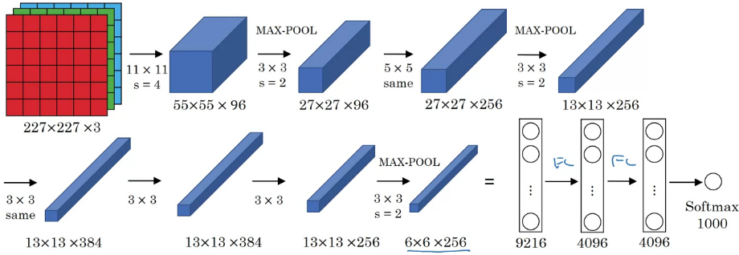
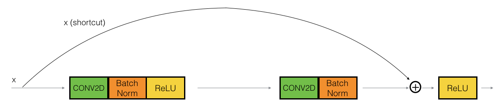
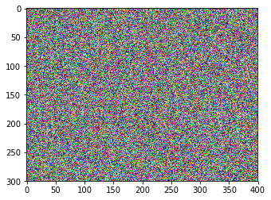
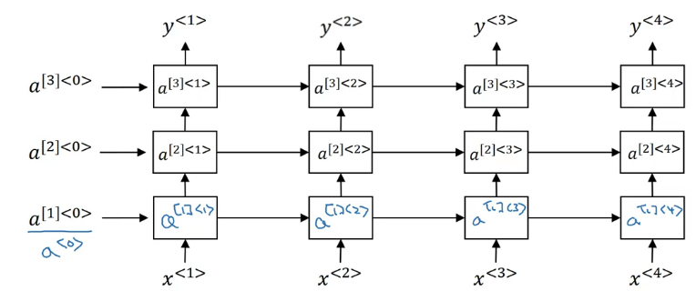

# Shallow Neural Network

## Introduction


对一条输入数据


$$
\begin{array}{l}{z^{[1]}=W^{[1]} x+b^{[1]}} \\ {a^{[1]}=\sigma\left(z^{[1]}\right)} \\ {z^{[2]}=W^{[2]} a^{[1]}+b^{[2]}} \\ {a^{[2]}=\sigma\left(z^{[2]}\right) = \hat{y}}\end{array}
$$
上标[1]、[2]等表示该变量是关于哪一层的变量，输入层是第0层，因此x也可表示为a^[0]^，从第一个hidden layer开始为第1层。

W,b分别是系数矩阵和偏置量，x是一条测试数据（列向量）。

定义
$$
X = (x^{(1)}, x^{(2)}, ..., x^{(m)}) \\
Z = (z^{(1)}, z^{(2)}, ..., z^{(m)}) \\
A = (a^{(1)}, a^{(2)}, ..., a^{(m)})
$$
向量化后为
$$
\begin{array}{l}{Z^{[1]}=W^{[1]} X+b^{[1]}} \\ {A^{[1]}=\sigma\left(Z^{[1]}\right)} \\ {Z^{[2]}=W^{[2]} A^{[1]}+b^{[2]}} \\ {A^{[2]}=\sigma\left(Z^{[2]}\right)}\end{array}
$$

预测值A^[2]^是行向量。

> $$
> \sigma(z) = \frac{1}{1 + e^{-z}} \\
> \sigma'(z) = \sigma(z)[1-\sigma(z)]
> $$


## Activation function

在激活函数的选择上，除了sigmoid函数以外，还可以选择其它非线性函数

- tanh函数 (双曲正切函数)
  $$
  a = g(z) = \text{tanh}(z) = \frac{e^z - e^{-z}}{e^z + e^{-z}}
  $$
  
  
  > $$
  > \text{tanh}'(z) = 1-\text{tanh}^2(z)
  > $$
  >
  > 
  
- 整流线性单元(rectify linear unit 或 ReLu)
  $$
  a = g(z) = max(0, z)
  $$
  

- Leaky ReLu
  $$
  a = g(z) = max(0.01z, z)
  $$
  

  系数0.01可以指定为远小于1的其它数


神经网络中的不同层的节点，可以分别使用不同的激活函数

只有在逻辑回归问题中的输出层节点通常使用sigmoid函数，在hidden layer通常使用ReLu函数。

ReLu函数和Leaky ReLu函数在0点处的导数值可以规定为其右极限或左极限中的任意一个值。

> 为什么一定要用非线性函数作为激活函数？
>
> 如果在所有hidden layer都使用线性激活函数，那么整个神经网络就将会退化为不含任何hidden layer的模型。如果在任一hidden layer使用线性激活函数，那么就相当于该层的前后两层是直接相连的。


## Back Propagation


# Deep Neural Network

$$
\begin{array}{l}{d Z^{[L]}=A^{[L]}-Y} \\ {d W^{[L]}=\frac{1}{m} d Z^{[L]} A^{[L-1]^{T}}} \\ {d b^{[L]}=\frac{1}{m} n p . s u m\left(d Z^{[L]}, \text { axis }=1, \text { keepdims }=\text { True }\right)} \\ {d Z^{[L-1]}=W^{[L]^{T}} d Z^{[L]} * g^{(L-1]}\left(Z^{[L-1]}\right)} \\ \vdots \\ {d Z^{[1]}=W^{[2]} d Z^{[2]} * g^{\{[1]}\left(Z^{[1]}\right)} \\ {d W^{[1]}=\frac{1}{m} d Z^{[1]} A^{[0]^{T}}} \\ d b^{[1]}=\frac{1}{m} n p . s u m\left(d Z^{[1]}, a x i s=1, \text { keepdims }=\text { True }\right)\end{array}
$$

Note that * denotes element-wise multiplication)

Note that $A^{[0]^T}$ is another way to denote the input features, which is also written as $X^T$


# Improving Deep Neural Networks

## L2 Regularization

The standard way to avoid overfitting is called **L2 regularization**. It consists of appropriately modifying your cost function, from:
$$J = -\frac{1}{m} \sum\limits_{i = 1}^{m} \large{(}\small  y^{(i)}\log\left(a^{[L](i)}\right) + (1-y^{(i)})\log\left(1- a^{[L](i)}\right) \large{)}$$
To:
$$J_{regularized} = \small \underbrace{-\frac{1}{m} \sum\limits_{i = 1}^{m} \large{(}\small y^{(i)}\log\left(a^{[L](i)}\right) + (1-y^{(i)})\log\left(1- a^{[L](i)}\right) \large{)} }_\text{cross-entropy cost} + \underbrace{\frac{1}{m} \frac{\lambda}{2} \sum\limits_l\sum\limits_k\sum\limits_j W_{k,j}^{[l]2} }_\text{L2 regularization cost}$$

Of course, because you changed the cost, you have to change backward propagation as well! All the gradients have to be computed with respect to this new cost.

- The cost computation:
  A regularization term is added to the cost
- The backpropagation function:
  There are extra terms in the gradients with respect to weight matrices
- Weights end up smaller ("weight decay"):
  Weights are pushed to smaller values.
- 

## Dropout Regularization

最常用的是反向随机失活算法

在进行训练，执行正向和反向传播算法时，对于每一条训练样例（每一个example），在神经网络的每一层随机敲除若干个结点，并连带去除其对应的输入输出，让该样例在这样一个简化后的神经网络上训练；然后对于下一条样例再执行一次这个随机处理过程，在这样处理后的另一个简化版神经网络上训练。

处理完所有样例后，完成一次迭代。对于每一次迭代，都要进行该随机处理过程。

例如：

对于第l层，keep_prob = 0.8 (表示第l层上的每一个结点有0.8的概率保留，0.2的概率被敲除)

生成一个随机的矩阵Dl（每一列对应一个样例）,表示相应位置的结点保留（1）或敲除（0）

Dl = np.random.rand(Al.shape[0], Al.shape[1])

Dl = (Dl < keep_prob).astype(int)

将Dl=0对应位置上的Al元素置为0

Al = np.multiply(Al, Dl)

为了在正向传播时，不改变预测结果的期望值，需要保持Al总体的期望保持不变，剩下的全体元素除以keep_prob

Al /= keep_prob

在正向和反向传播时都需要在随机处理过后的简化神经网络上进行

Backpropagation with dropout is actually quite easy. You will have to carry out 2 Steps:

- You had previously shut down some neurons during forward propagation, by applying a mask  D[1]D[1]  to A1. In backpropagation, you will have to shut down the same neurons, by reapplying the same mask  D[1]D[1]  to dA1.
- During forward propagation, you had divided A1 by keep_prob. In backpropagation, you'll therefore have to divide dA1 by keep_prob again (the calculus interpretation is that if  A[1]A[1]  is scaled by keep_prob, then its derivative  dA[1]dA[1]  is also scaled by the same keep_prob).

注意：在测试预测时，不使用该随机敲除的过程，即和正常的正向传播算法完全相同。

- Dropout is a regularization technique.
- You only use dropout during training. Don't use dropout (randomly eliminate nodes) during test time.
- Apply dropout both during forward and backward propagation.
- During training time, divide each dropout layer by keep_prob to keep the same expected value for the activations. 


## How to Understand Dropout

随机失活算法本质上是避免训练过程依赖某几个特征参数来实现代价函数的下降，而迫使对代价函数下降的“贡献”尽可能地分散在各个特征参数上。

和正则化（regularization）是起到相同的效果，将“贡献”分散后也就会起到减小正则化项（平方项）的作用。但随机失活算法更加具有自适应性。

在选择keep_prob时，对于单元数多的层取较小的keep_prob，对单元数少的层取较大的keep_prob甚至取1，对第0层（即输入层）取keep_prob=1

随机失活算法的缺点是会让debug无法进行，因为每次训练所用的网络都不能再现，代价函数的定义是具有随机性的。办法是在debug时关闭随机失活（keep_prob全取1），debug完后再开启。


## Vanishing / Exploding gradients

由于网络很深（L很大），并且由于Relu激活函数的使用，当权重矩阵W中的元素普遍大于1时，梯度会以L次幂指数级增加，即为梯度爆炸；反之，当权重矩阵W中的元素普遍小于1时，梯度会以(-L)次幂指数级减小，即为梯度消失。

以目前的技术无法消除梯度爆炸和梯度消失现象，但可以通过合理的权重值初始化，尽可能减缓这些问题。

当忽略b的影响时
$$
z = w_1x_1+w_2x_2+\dots+w_nx_n
$$
令w~n~的方差
$$
\text{var}(w_n)=\frac{1}{n}
$$
即标准差
$$
\text{std}(w_n)=\sqrt{\frac{1}{n}}
$$


则当 $\text{var}(x_n)=1$ 时（通过归一化来实现），$\text{var}(z)=1$，这就保持了方差不扩大，最终损失函数的方差也就不扩大

在实际初始化W时，如果使用的Relu函数，则令方差为2/n
$$
W^{[l]}=np.random.randn(shape) * np.sqrt(2/n^{[l-1]})
$$
即“He. initialization”

如果使用的是tanh函数，则令方差为1/n，又称为Xavier initialization.

- Different initializations lead to different results
- Random initialization is used to break symmetry and make sure different hidden units can learn different things
- Don't intialize to values that are too large
- He. initialization works well for networks with ReLU activations.


## Optimization Algorithms

简单的梯度下降算法训练的速度还比较慢，可以用其它更先进的优化算法。好的优化算法可能使原本几天完成的训练过程在几个小时内完成

**Notations**: As usual, $\frac{\partial J}{\partial a } = $ `da` for any variable `a`.

### Mini-Batch Gradient descent

之前的梯度下降算法过程中，每次迭代会输入整个数据集，称为Batch Gradient descent；而Mini-Batch Gradient descent 就是一次迭代只输入其中k条数据，k一般取64,128,256,512等。

此外，还有一种极端的做法，一次迭代只输入1条数据，称为Stochastic gradient descent，一般不会使用。

- The difference between gradient descent, mini-batch gradient descent and stochastic gradient descent is the number of examples you use to perform one update step.
- You have to tune a learning rate hyperparameter $\alpha$.
- With a well-turned mini-batch size, usually it outperforms either gradient descent or stochastic gradient descent (particularly when the training set is large).

Build mini-batches from the training set (X, Y). There are two steps:

- **Shuffle**: Create a shuffled version of the training set (X, Y) as shown below. Each column of X and Y represents a training example. Note that the random shuffling is done synchronously between X and Y. Such that after the shuffling the $i^{th}$ column of X is the example corresponding to the $i^{th}$ label in Y. The shuffling step ensures that examples will be split randomly into different mini-batches. 


    permutation = list(np.random.permutation(m))
    shuffled_X = X[:, permutation]
    shuffled_Y = Y[:, permutation].reshape((1,m))
- **Partition**: Partition the shuffled (X, Y) into mini-batches of size `mini_batch_size` (here 64). Note that the number of training examples is not always divisible by `mini_batch_size`. The last mini batch might be smaller, but you don't need to worry about this.

```
num_complete_minibatches = math.floor(m/mini_batch_size)
for k in range(0, num_complete_minibatches):
    mini_batch_X = shuffled_X[:, k * mini_batch_size : (k + 1) * mini_batch_size]
    mini_batch_Y = shuffled_Y[:, k * mini_batch_size : (k + 1) * mini_batch_size]
    mini_batch = (mini_batch_X, mini_batch_Y)
    mini_batches.append(mini_batch)

# Handling the end case (last mini-batch < mini_batch_size)
if m % mini_batch_size != 0:
    mini_batch_X = shuffled_X[:, num_complete_minibatches * mini_batch_size :]
    mini_batch_Y = shuffled_Y[:, num_complete_minibatches * mini_batch_size :]
    mini_batch = (mini_batch_X, mini_batch_Y)
    mini_batches.append(mini_batch)
```


### Exponentially weighted averages

在一些高级的优化算法中经常要求均值，一般会使用更高效的求均值算法。

指数加权平均是一种近似计算平均值的online算法，空间复杂度只有O(1)

对于一组数据$ x_1, x_2, x_3, ..., x_n $，按如下方式计算$v_t$
$$
\begin{aligned}
& v_0 = 0 \\
& v_1 = 0.9 v_0 + 0.1x_1 \\
& v_2 = 0.9 v_1 + 0.1x_2 \\
& \dots \\
& v_n = 0.9 v_{n-1} + 0.1x_n
\end{aligned}
$$
即
$$
v_t = \beta v_{t-1} + (1-\beta)x_t
$$
则$v_t$近似为前$\frac{1}{1-\beta}$个x值的平均值，如果蓝色数据点表示x，红色数据点表示v


- 偏差修正

实际上述计算出的的近似均值点v的前10个点（更一般地，前$\frac{1}{1-\beta}$个点），距离真实的均值相差较大，可使用以下算法修正：
$$
v_t := \frac{v_t}{1-\beta^t}
$$

### Momentum

Because mini-batch gradient descent makes a parameter update after seeing just a subset of examples, the direction of the update has some variance, and so the path taken by mini-batch gradient descent will "oscillate" toward convergence. Using momentum can reduce these oscillations.

Momentum takes into account the past gradients to smooth out the update. We will store the 'direction' of the previous gradients in the variable $v$. Formally, this will be the exponentially weighted average of the gradient on previous steps. You can also think of $v$ as the "velocity" of a ball rolling downhill, building up speed (and momentum) according to the direction of the gradient/slope of the hill. 


The red arrows shows the direction taken by one step of mini-batch gradient descent with momentum. The blue points show the direction of the gradient (with respect to the current mini-batch) on each step. Rather than just following the gradient, we let the gradient influence $v$ and then take a step in the direction of $v$.
$$
\begin{aligned}
&v_{dW} = 0 \\
&v_{db} = 0 \\
&\text{on iteration t:} \\
& \quad \text{for} \quad l = 1, ..., L: \\
& \quad \text{compute dW, db on curren mini-batch} \\
& \quad v_{dW^{[l]}} = \beta v_{dW^{[l]}} + (1 - \beta) dW^{[l]}  \\
& \quad v_{db^{[l]}} = \beta v_{db^{[l]}} + (1 - \beta) db^{[l]}  \\
& \quad W^{[l]} = W^{[l]} - \alpha v_{dW^{[l]}} \\
& \quad b^{[l]} = b^{[l]} - \alpha v_{db^{[l]}}  \\
\end{aligned}
$$
**Note** that:
- The velocity is initialized with zeros. So the algorithm will take a few iterations to "build up" velocity and start to take bigger steps.
- If $\beta = 0$, then this just becomes standard gradient descent without momentum. 

**How do you choose $\beta$?**

- The larger the momentum $\beta$ is, the smoother the update because the more we take the past gradients into account. But if $\beta$ is too big, it could also smooth out the updates too much. 
- Common values for $\beta$ range from 0.8 to 0.999. If you don't feel inclined to tune this, $\beta = 0.9$ is often a reasonable default. 
- Tuning the optimal $\beta$ for your model might need trying several values to see what works best in term of reducing the value of the cost function $J$. 

### RMS prop

方均根传播是另一种加速梯度下降的算法。

考虑代价函数的梯度，在下降过程中，沿某个方向x的梯度分量很小，而沿另一个方向y的梯度分量很大，我们希望每一次迭代沿x方向多走一点，沿y方向少走一点。

方均根传播是将前几次下降过程中的梯度各分量的方均根算出来，根据该方均根值调整下降的步长：
$$
\begin{aligned}
&S_{dW} = 0 \\
&S_{db} = 0 \\
&\text{on iteration t:} \\
& \quad \text{for} \quad l = 1, ..., L: \\
& \quad \text{compute dW, db on curren mini-batch} \\
& \quad S_{dW^{[l]}} = \beta S_{dW^{[l]}} + (1 - \beta) (dW^{[l]})^2  \\
& \quad S_{db^{[l]}} = \beta S_{db^{[l]}} + (1 - \beta) (db^{[l]})^2  \\
& \quad W^{[l]} = W^{[l]} - \alpha \frac{dW^{[l]}}{\sqrt{S_{dW^{[l]}}}} \\
& \quad b^{[l]} = b^{[l]} - \alpha \frac{db^{[l]}}{\sqrt{S_{db^{[l]}}}}  \\
\end{aligned}
$$

$\beta$通常取0.999.

为了避免除0错误，通常会在上述分母上加一个非常小的值$\epsilon$，通常为1e-8，该值通常不需要调参，对性能没有影响。


### Adam Optimization Algorithm

实际工作更多使用的是将动量算法和该方均根传播算法相结合的Adam算法（自适应矩估计算法）。

**How does Adam work?**
1. It calculates an exponentially weighted average of past gradients, and stores it in variables $v$ (before bias correction) and $v^{corrected}$ (with bias correction). 
2. It calculates an exponentially weighted average of the squares of the past gradients, and  stores it in variables $s$ (before bias correction) and $s^{corrected}$ (with bias correction). 
3. It updates parameters in a direction based on combining information from "1" and "2".

The update rule is, for $l = 1, ..., L$: 

$$\begin{cases}
v_{dW^{[l]}} = \beta_1 v_{dW^{[l]}} + (1 - \beta_1) \frac{\partial \mathcal{J} }{ \partial W^{[l]} } \\
v^{corrected}_{dW^{[l]}} = \frac{v_{dW^{[l]}}}{1 - (\beta_1)^t} \\
s_{dW^{[l]}} = \beta_2 s_{dW^{[l]}} + (1 - \beta_2) (\frac{\partial \mathcal{J} }{\partial W^{[l]} })^2 \\
s^{corrected}_{dW^{[l]}} = \frac{s_{dW^{[l]}}}{1 - (\beta_2)^t} \\
W^{[l]} = W^{[l]} - \alpha \frac{v^{corrected}_{dW^{[l]}}}{\sqrt{s^{corrected}_{dW^{[l]}}} + \varepsilon}
\end{cases}$$
where:
- t counts the number of steps taken of Adam 
- L is the number of layers
- $\beta_1$ and $\beta_2$ are hyperparameters that control the two exponentially weighted averages. 
- $\alpha$ is the learning rate
- $\varepsilon$ is a very small number to avoid dividing by zero, always be 1e-8

db也做同样处理.


### The problem of local optima

通常所谓的局部最优点出现的概率不高，一般出现的是“鞍点”。

因为神经网络的参数向量一般是一个非常高维的向量，当梯度达到0时，局部最优点要在所有维度上的分量都是凹函数时才会出现，概率很低；而一部分维度上的分量为凸函数，另一部分分量为凹函数时，为“鞍点”。

如果出现接近某一鞍点时，某一维度方向上的梯度很小，会花很长的时间才能跨过。

使用Adam优化算法能加速跨过这种鞍点的过程。


## Learning Rate Decay

可以在训练的过程中逐渐减小学习速率，使得一开始可以使用较大的学习速率，以下是若干个学习速率衰减策略:

(1 epoch = 1 pass through the whole data set)

- 

$$
\alpha = \dfrac{1}{1+DecayRate*EpochNum}\alpha_0
$$

- 

$$
\alpha = 0.95^{EpochNum}\alpha_0
$$

- t is the number of mini-batches

$$
\alpha=\left\{ 
\begin{align}
&\alpha_1 & 0 \le t < t_1 \\
&\alpha_2 & t_1 \le t < t_2 \\
& \vdots
\end{align}
\right.
$$

- change learning rate manually


## Batch Normalization

一般的归一化是仅针对输入层数据的归一化，使输入数据符合均值0方差1的分布。

批量归一化是对所有隐藏层的归一化，使出入下一层的激活值均值0方差1，可以加速训练过程。

批量归一化作用于 $z^{[l](i)}$ 上。首先和输入层的归一化一样，计算所有数据在该位置上的激活值的均值和方差，减去均值，除以标准差。为了防止除0错误，分母上有个加$\epsilon$的项，一般取1e-8。

（以下均针对第l层，式中省略[l]上标）
$$
\begin{aligned}
& \mu = \dfrac{1}{m}\sum_iz^{(i)} \\
& \sigma^2 = \dfrac{1}{m}\sum_i(z^{(i)} - \mu)^2 \\
& z_{norm}^{(i)}=\dfrac{z^{(i)}-\mu}{\sqrt{\sigma^2+\epsilon}} \\
\end{aligned}
$$
虽然将z的值进行了归一化，但为了使模型代价最小，需要每一层的激活值分布有其它的均值和标准差，因此再对归一化后的值改变为某种均值-标准差分布
$$
\tilde{z}^{(i)} = \gamma z_{norm}^{(i)}+\beta
$$
其中 $\gamma,\beta$ 均为模型参数，和W,b一样，通过优化算法（梯度下降，Adam等）来迭代更新

通过学习到不同的 $\gamma,\beta$ 值，来控制该位置的z值的均值和标准差分别为$\gamma,\beta$。


### Fitting Batch Norm into a Neural Network

- 使用mini-batch时，均值，方差的计算都是一个针对这一个mini-batch的
- 正向传播时，忽略b，即令b=0。因为z中的每一个值$z_i$都会减去各自的均值$\mu_i$，因此无论b是多少结果都一样。同样，反向传播时也忽略db。
- 反向传播时，相应的导数也要变化，主要是多了$d\gamma, d\beta$，少了db。
- 以上Batch Norm步骤，将z进行的一系列处理，与没有引入Batch Norm时比，可以看作是对$a^{[l-1]} \rightarrow z^{[l]}$ 映射关系的修改，修改后的映射仍为线性关系，只不过引入了新的学习参数$\gamma,\beta$。
- 当使用该模型进行预测时，输入是单一一条数据，均值方差怎么确定？应该使用训练过程中各个mini-batch产生的均值方差的指数加权平均值，在训练过程中就计算并记录下来该值。


**Why does Batch Norm work**

批量归一化减小了较前的层中数据变化对较后的层的影响。

在训练过程中，前层的数据发生变化，由于批量归一化的作用，后层的数据仍然被限定到特定的概率分布中，使得后层已经训练出的结果不需要做太大的变动。

使得各层的训练独立性增加。


## Multi-class classification

逻辑回归用于产生0,1两种结果的分类，当面对多分类问题时，虽然可以训练多个逻辑回归结点，更好的选择是使用softmax激活函数。

首先将z送入e指数函数处理，再计算各分量占所有分量和的比例，即
$$
a^{[L]} = \dfrac{e^{z^{[L]}}}{\sum_ie^{z^{[L]}_i}}
$$

### Loss Function

数据标记（一条数据）：1表示所属类别为该位置对应的类
$$
y = [0, 0, ...,0, 1, 0, ...,0]
$$
预测向量
$$
\hat{y} = a^{[L]}
$$
损失函数 
$$
L(\hat{y}, y) = -\sum_i y_i \log \hat{y}_i
$$
整个数据集的损失函数
$$
J(W^{[1]},b^{[1]},...) = \frac{1}{m}\sum_j^mL(\hat{y}, y) 
$$

### Gradient descent

softmax激活函数求导
$$
\begin{aligned} \frac{\partial L}{\partial z_{i}}=&-\sum_{k} y_{k} \frac{\partial \log \hat{y}_{k}}{\partial z_{i}}=-\sum_{k} y_{k} \frac{1}{\hat{y}_{k}} \frac{\partial \hat{y}_{k}}{\partial z_{i}} \\=&-y_{i}\left(1-\hat{y}_{i}\right)-\sum_{k \neq i} y_{k} \frac{1}{\hat{y}_{k}}\left(-\hat{y}_{k} \hat{y}_{i}\right) \\ &=-y_{i}\left(1-\hat{y}_{i}\right)+\sum_{k \neq i} y_{k}\left(\hat{y}_{i}\right) \\ &=-y_{i}+y_{i} \hat{y}_{i}+\sum_{k \neq i} y_{k}\left(\hat{y}_{i}\right) \\=& \hat{y}_{i}\left(\sum_{k} y_{k}\right)-y_{i}=\hat{y}_{i}-y_{i} \end{aligned}
$$
即
$$
dZ^{[L]}=\frac{1}{m}(\hat{Y} - Y)
$$


# Convolutional Neural Networks

> **Notation**:
> - Superscript $[l]$ denotes an object of the $l^{th}$ layer. 
>     - Example: $a^{[4]}$ is the $4^{th}$ layer activation. $W^{[5]}$ and $b^{[5]}$ are the $5^{th}$ layer parameters.
>
>
> - Superscript $(i)$ denotes an object from the $i^{th}$ example. 
>     - Example: $x^{(i)}$ is the $i^{th}$ training example input.
>    
> - Subscript $i$ denotes the $i^{th}$ entry of a vector.
>     - Example: $a^{[l]}_i$ denotes the $i^{th}$ entry of the activations in layer $l$, assuming this is a fully connected (FC) layer.
>    
> - $n_H$, $n_W$ and $n_C$ denote respectively the height, width and number of channels of a given layer. If you want to reference a specific layer $l$, you can also write $n_H^{[l]}$, $n_W^{[l]}$, $n_C^{[l]}$. 
> - $n_{H_{prev}}$, $n_{W_{prev}}$ and $n_{C_{prev}}$ denote respectively the height, width and number of channels of the previous layer. If referencing a specific layer $l$, this could also be denoted $n_H^{[l-1]}$, $n_W^{[l-1]}$, $n_C^{[l-1]}$. 


## Edge Detection

深度学习中的“卷积”运算与数字信号处理中的“卷积”定义不同，省略了水平垂直翻转操作，即相当于cross-correlation运算（加权求和）。

卷积运算符右侧的矩阵称为“core”或“filter”或"window"

常用的边缘检测核：

- 垂直边缘$\begin{bmatrix} 1 & 0 & -1 \\ 1 & 0 & -1 \\ 1 & 0 & -1\end{bmatrix}$， 水平边缘$\begin{bmatrix} 1 & 1 & 1 \\ 0 & 0 & 0 \\ -1 & -1 & -1\end{bmatrix}$

- 垂直边缘$\begin{bmatrix} 1 & 0 & -1 \\ 2 & 0 & -2 \\ 1 & 0 & -1\end{bmatrix}$ ，水平边缘$\begin{bmatrix} 1 & 2 & 1 \\ 0 & 0 & 0 \\ -1 & -2 & -1\end{bmatrix}$，sobel filter
- 垂直边缘$\begin{bmatrix} 3 & 0 & -3 \\ 10 & 0 & -10 \\ 3 & 0 & -3\end{bmatrix}$，水平边缘$\begin{bmatrix} 3 & 10 & 3 \\ 0 & 0 & 0 \\ -3 & -10 & -3\end{bmatrix}$，scharr filter

$边缘提取结果=\sqrt{垂直边缘提取结果^2 + 水平边缘提取结果^2}$


## Padding

若原图大小为n x n，过滤器大小为f x f，则卷积结果为(n-f+1) x (n-f+1)，如果要保持卷积运算结果和原图大小相同，需要在原图周围用0填充，填充的边缘宽度为p

例如原图大小为6 x 6，p=1，则填充后的图大小为8 x 8

考虑填充的情况，卷积运算结果的大小为n+2p-f+1

- Valid convolutions: 填充为0的卷积运算
- Same convolutions: 适当填充使得卷积运算结果与原图大小相同的卷积运算

注：通常过滤器的大小选择为长宽均为奇数的方阵

The main benefits of padding are the following:

- It allows you to use a CONV layer without necessarily shrinking the height and width of the volumes. This is important for building deeper networks, since otherwise the height/width would shrink as you go to deeper layers. An important special case is the "same" convolution, in which the height/width is exactly preserved after one layer. 
- It helps us keep more of the information at the border of an image. Without padding, very few values at the next layer would be affected by pixels as the edges of an image.


## Strided Convolutions

通常的卷积运算，过滤器在原图上的移动为从左到右，从上到下，一次一移动1格。

带步长的卷积运算，过滤器的移动为一次移动s格（若移动后超出原图范围，则不进行此次移动）

带步长的卷积运算，结果的大小为：
$$
\lfloor \dfrac{n + 2p - f}{s} + 1 \rfloor \times \lfloor \dfrac{n + 2p - f}{s} + 1 \rfloor
$$


## Convolutions Over Volume

对于RGB图像，有3个通道，卷积与需要在三个通道上同时进行

对于通道数为n~c~的输入，使用的过滤器大小应该为f x f x n~c~，过滤器不同通道的值不一定相同

过滤器在卷积的过程中，每移动一次，产生一个数，为f x f x n~c~个数与对应输入中的值加权后的总和

例如：

对于6 x 6 x 3的输入，用3 x 3 x 3的过滤器，产生结果大小为4 x 4

可以依次使用n~f~个过滤器处理输入，每个过滤器的大小均相同，产生多个相同大小的结果，多个结果层叠（stack）在一起，形成一个n~f~个通道的输出

例如：

对于6 x 6 x 3的输入，用2个3 x 3 x 3的过滤器，产生结果大小为4 x 4 x 2


## One Layer of a Convolutional Network

将每一个过滤器产生的卷积结果，加上偏置值b，送入ReLu函数处理，输出一个结果。

将所有过滤器产生的结果如此处理后，层叠（stack）在一起，形成n~f~通道的输出。


所有过滤器中的值，偏置值，都是需要通过学习得到的参数

学习参数的个数：

例如有10个大小为3 x 3 x 3的过滤器，则这一层的变量个数为:

(3 x 3 x 3 + 1) x 10 = 280


## Pooling Layers

- Max Pooling（常用）

过滤器在移动过程中不是加权求和，而是求最大值


- Average Pooling

不是求最大值，而是求平均值


注：池化层没有学习参数，只有超参数

- f: filter size

- s: stride

- Max or average pooling


## Fully Connected Layer (FC) / Dense Layer

就是将输入展开为一维向量，与输出的激活值做全连接，即与经典神经网络层相同

z = Wx + b

a = g(z)


## CNN Example


注：

- 通常将conv-pool的组合看作一层
- 池化层相当于经典神经网络中的ReLu函数的作用
- 通常随着层数的深入，通道数逐渐增大，长宽逐渐减小，最后是全连接层


## Advantages of CNN

- Parameter sharing: A feature detector (such as a vertical edge detector) that 's useful in one part of the image is probably useful in another part of the image.
- Sparsity of connecions: In each layer, each output value depends only on a small number of inputs.


## Batch Normalization of CNN

之前所说的对于经典神经网络的batch normalization，是每一个units/neurons在所有m个数据上平均/求方差。即：对于n个units，需要学习n组$\gamma,\beta$ 

而对于CNN，是每一个channel，在所有m * H * W个数值是求平均/方差。即：对于C个channel，需要学习C组$\gamma,\beta$ 。

理解：

原则是对每一个feature，在其生成的所有数据上求平均/方差。

对于CNN来说，一个channel上的H * W个值都是由同一个卷积核生成的，这H * W个数是一个feature生成的，如果有m张图，一个channel对应一个feature对应m * H * W个数。（对比于经典神经网络，仿佛是在m * H * W个数据上得到的一个激活值）


## Backpropagation in convolutional neural networks

In modern deep learning frameworks, you only have to implement the forward pass, and the framework takes care of the backward pass, so most deep learning engineers don't need to bother with the details of the backward pass. The backward pass for convolutional networks is complicated. 

### Computing dA:

This is the formula for computing $dA$ with respect to the cost for a certain filter $W_c$ and a given training example:

$$ dA += \sum _{h=0} ^{n_H} \sum_{w=0} ^{n_W} W_c \times dZ_{hw} \tag{1}$$

Where $W_c$ is a filter and $dZ_{hw}$ is a scalar corresponding to the gradient of the cost with respect to the output of the conv layer Z at the hth row and wth column (corresponding to the dot product taken at the ith stride left and jth stride down). Note that at each time, we multiply the the same filter $W_c$ by a different dZ when updating dA. We do so mainly because when computing the forward propagation, each filter is dotted and summed by a different a_slice. Therefore when computing the backprop for dA, we are just adding the gradients of all the a_slices. 

In code, inside the appropriate for-loops, this formula translates into:
```python
da_prev_pad[vert_start:vert_end, horiz_start:horiz_end, :] += W[:,:,:,c] * dZ[i, h, w, c]
```

### Computing dW:

This is the formula for computing $dW_c$ ($dW_c$ is the derivative of one filter) with respect to the loss:

$$ dW_c  += \sum _{h=0} ^{n_H} \sum_{w=0} ^ {n_W} a_{slice} \times dZ_{hw}  \tag{2}$$

Where $a_{slice}$ corresponds to the slice which was used to generate the activation $Z_{ij}$. Hence, this ends up giving us the gradient for $W$ with respect to that slice. Since it is the same $W$, we will just add up all such gradients to get $dW$. 

In code, inside the appropriate for-loops, this formula translates into:
```python
dW[:,:,:,c] += a_slice * dZ[i, h, w, c]
```

### Computing db:

This is the formula for computing $db$ with respect to the cost for a certain filter $W_c$:

$$ db = \sum_h \sum_w dZ_{hw} \tag{3}$$

As you have previously seen in basic neural networks, db is computed by summing $dZ$. In this case, you are just summing over all the gradients of the conv output (Z) with respect to the cost. 

In code, inside the appropriate for-loops, this formula translates into:
```python
db[:,:,:,c] += dZ[i, h, w, c]
```

### Pooling Layer

- max pooling

  define the mask of window according to the shape of the filter such as:

$$
 X = \begin{bmatrix}
1 && 3 \\
4 && 2
\end{bmatrix} \quad \rightarrow  \quad M =\begin{bmatrix}
0 && 0 \\
1 && 0
\end{bmatrix}\tag{4}
$$

- average pooling

  define the mask of window according to the shape of the filter such as :
  $$
  M =\begin{bmatrix}
  1/4 && 1/4 \\
  1/4 && 1/4
  \end{bmatrix}\tag{5}
  $$
  let dA be the gradient of cost with respect to the output of the pooling layer, same shape as A, dA_prev the gradient of cost with respect to the input of the pooling layer, same shape as A_prev

```
dA_prev[i, vert_start: vert_end, horiz_start: horiz_end, c] += M * dA[i, h, w, c]
```


# Case of Networks

- LeNet-5


在池化层后有非线性处理，原文中用sigmoid/tanh而非relu

ref: LeCun et al., 1998. Gradient-based learning applied to document recognition

- AlexNet



相比LeNet-5有更大规模的参数，使用了relu函数进非线性处理

ref: Krizhevshy et. al., 2012. ImageNet classification with deep convolution neural networks

- VGG-16

CONV = 3x3 filter, s=1, same

MAX-POOL = 2x2, s=2


结构统一，卷积层数量倍增，通过池化层将长宽半数减小

ref: Simonyan & Zisserman 2015. Very deep convolutional networks for large-scale image recognition


## Resudual Networks

### The problem of very deep neural networkss

In recent years, neural networks have become deeper, with state-of-the-art networks going from just a few layers (e.g., AlexNet) to over a hundred layers.

* The main benefit of a very deep network is that it can represent very complex functions. It can also learn features at many different levels of abstraction, from edges (at the shallower layers, closer to the input) to very complex features (at the deeper layers, closer to the output). 
* However, using a deeper network doesn't always help. A huge barrier to training them is vanishing gradients: very deep networks often have a gradient signal that goes to zero quickly, thus making gradient descent prohibitively slow. 
* More specifically, during gradient descent, as you backprop from the final layer back to the first layer, you are multiplying by the weight matrix on each step, and thus the gradient can decrease exponentially quickly to zero (or, in rare cases, grow exponentially quickly and "explode" to take very large values). 
* During training, you might therefore see the magnitude (or norm) of the gradient for the shallower layers decrease to zero very rapidly as training proceeds: 


### Building a Residual Network

In ResNets, a "shortcut" or a "skip connection" allows the model to skip layers:  


The image on the left shows the "main path" through the network. The image on the right adds a shortcut to the main path. By stacking these ResNet blocks on top of each other, you can form a very deep network. 

Having ResNet blocks with the shortcut also makes it very easy for one of the blocks to learn an identity function. This means that you can stack on additional ResNet blocks with little risk of harming training set performance.  

(There is also some evidence that the ease of learning an identity function accounts for ResNets' remarkable performance even more so than skip connections helping with vanishing gradients).

Two main types of blocks are used in a ResNet, depending mainly on whether the input/output dimensions are same or different:  the "identity block" and the "convolutional block."

- The identity block

The identity block is the standard block used in ResNets, and corresponds to the case where the input activation (say $a^{[l]}$) has the same dimension as the output activation (say $a^{[l+2]}$). Here is an alternative diagram showing the individual steps:



The upper path is the "shortcut path." The lower path is the "main path." In this diagram, we have also made explicit the CONV2D and ReLU steps in each layer. To speed up training we have also added a BatchNorm step.

A slightly more powerful version of this identity block: the skip connection "skips over" 3 hidden layers rather than 2 layers. 


- The convolutional block

The ResNet "convolutional block" is the second block type. You can use this type of block when the input and output dimensions don't match up. The difference with the identity block is that there is a CONV2D layer in the shortcut path: 


* The CONV2D layer in the shortcut path is used to resize the input $x$ to a different dimension, so that the dimensions match up in the final addition needed to add the shortcut value back to the main path. 
* For example, to reduce the activation dimensions's height and width by a factor of 2, you can use a 1x1 convolution with a stride of 2. 
* The CONV2D layer on the shortcut path does not use any non-linear activation function. Its main role is to just apply a (learned) linear function that reduces the dimension of the input, so that the dimensions match up for the later addition step. 


### Why do residual networks work

Residual networks 可以很容易地训练与恒等函数关系，因此在网络深度很深时，也能保证至少不损害网络的整体性能


### A 50 layers ResNet model

The following figure describes in detail the architecture of this neural network. "ID BLOCK" in the diagram stands for "Identity block," and "ID BLOCK x3" means you should stack 3 identity blocks together.


The details of this ResNet-50 model are:
- Zero-padding pads the input with a pad of (3,3)
- Stage 1:
    - The 2D Convolution has 64 filters of shape (7,7) and uses a stride of (2,2). Its name is "conv1".
    - BatchNorm is applied to the 'channels' axis of the input.
    - MaxPooling uses a (3,3) window and a (2,2) stride.
- Stage 2:
    - The convolutional block uses three sets of filters of size [64,64,256], "f" is 3, "s" is 1 and the block is "a".
    - The 2 identity blocks use three sets of filters of size [64,64,256], "f" is 3 and the blocks are "b" and "c".
- Stage 3:
    - The convolutional block uses three sets of filters of size [128,128,512], "f" is 3, "s" is 2 and the block is "a".
    - The 3 identity blocks use three sets of filters of size [128,128,512], "f" is 3 and the blocks are "b", "c" and "d".
- Stage 4:
    - The convolutional block uses three sets of filters of size [256, 256, 1024], "f" is 3, "s" is 2 and the block is "a".
    - The 5 identity blocks use three sets of filters of size [256, 256, 1024], "f" is 3 and the blocks are "b", "c", "d", "e" and "f".
- Stage 5:
    - The convolutional block uses three sets of filters of size [512, 512, 2048], "f" is 3, "s" is 2 and the block is "a".
    - The 2 identity blocks use three sets of filters of size [512, 512, 2048], "f" is 3 and the blocks are "b" and "c".
- The 2D Average Pooling uses a window of shape (2,2) and its name is "avg_pool".
- The 'flatten' layer doesn't have any hyperparameters or name.
- The Fully Connected (Dense) layer reduces its input to the number of classes using a softmax activation. 


ref: He et al., 2015. Deep residual networks for image recognition

Kaiming He, Xiangyu Zhang, Shaoqing Ren, Jian Sun. Deep Residual Learning for Image Recognition


## Inception Network

在一个Layer中同时使用多种卷积核，将产生的所有结果堆叠在一起，形成一个Volume


为了减小计算所需要的成本，会利用1x1卷积

1x1卷积就是使用1x1xC大小的卷积核，可以用于减小Volume的通道个数n_C

在Inception Network中，对于需要进行卷积运算的地方，先进行一次1x1卷积运算减小n_C，再用原来的卷积核进行运算：


### Actual Inception Network Block


ref: Szegedy et al., 2014. Going Deeper with Convolutions


#  Object Detection Algorithm

物体检测通常需要面对一幅图像中有多个对象的情况

如果一幅图像中仅有一个对象，称为Classification with localization

## Classification with localization

与图像分类相比，除了输出一个表示类别的向量，还要额外输出几个值，表示一个方框，将目标的位置标示出来。

方框的位置有4个值表示：中心点的xy坐标，方框的高和宽（也可以用左上角和右下角的坐标表示，也是4个值）

通常约定图像最左上角为(0,0)，右下角为(1,1)

例如检测3类目标（再加上3类目标均不存在的情况）

1 - pedestrian

2 - car

3 - motorcycle

4 - background

图像的label格式如下：
$$
y = \begin{bmatrix}
p_c \\ b_x \\ b_y \\ b_h \\ b_w \\ c_1 \\ c_2 \\c_3
\end{bmatrix}
$$
$p_c$表示目标存在的概率，$b_x,b_y,b_h,b_w$表示方框位置，$c_1,c_2,c_3$表示目标属于哪一个类别，所属的类别对应的c值为1，其它为0


如这两种情况下的图片label应分别为
$$
\begin{bmatrix}
1 \\ 0.45 \\ 0.7 \\ 0.4 \\ 0.4 \\ 0 \\ 1 \\0
\end{bmatrix},
\begin{bmatrix}
0 \\ ？ \\ ？ \\ ？ \\ ？ \\ ？ \\ ？ \\？
\end{bmatrix}
$$
？表示"don't care"，此处的值不影响最终的cost函数

cost函数由label与CNN输出结果来定义，可以用均方差或log likelyhood lost等方式定义


## Landmark detection

例如需要得到一张人脸的眼角的位置，嘴的轮廓上各点的位置等等，即为地标检测

与分类问题相比，只是把输出层改为了各个地标点的坐标

如果需要检测k个点，则输出层为2k个值


## Convolutional Implementation of Sliding Windows

传统的滑动窗口检测就是定义一个固定大小的矩形框，将框内的图像送入CNN分类网络中；

然后将矩形框按一定的步长，移动到下一个位置，不断重复上述过程，直到遍历完整张图片，最后把检测到目标的框的位置输出出来。

传统的滑动窗口检测问题在于所需要的计算成本太高了。

通过卷积来实现滑动窗口可以显著减小计算成本


### Turning FC layer into convolutional layers


对于一个5x5x16的volume，使用400个5x5的卷积核，可以形成一个1x1x400的voume，和FC层的效果是一样的


首先使用卷积来实现CNN中的FC层

将14x14x3的“窗口”送入CNN的输入端，产生一个1x1x4的输出

再把一个16x16x3的图像送入相同的CNN，会产生一个2x2x4的输出，该2x2个cell分别对应“窗口”在图像中以步长2移动所到达的4个位置的CNN输出


"窗口"的步长是由MAX-POOL层控制的，这里MAX-POOL是2x2的，所以“窗口”的步长是2x2

ref: Sermanet et al., 2014, OverFeat: Integrated recognition, localization and detection using convolutional networks


## YOLO Algorithm

滑动窗口仍然不能输出准确的物体边界框，更好的算法是YOLO算法

首先将矩形图像用网格分割，通常分割为19x19。每一个单元格(cell)，对应一个输出，输出的格式与Classification with localization相同，假定检测的类别数与Classification with localization中描述的相同，即
$$
y = \begin{bmatrix}
p_c \\ b_x \\ b_y \\ b_h \\ b_w \\ c_1 \\ c_2 \\c_3
\end{bmatrix}
$$
label的定义有一些不同：

- 只有物体的边界框的中心点所在的那一个cell，才负责标记该边界框，即只有那一个cell的$p_c=1$，其周围的其它cell或许也包含了该物体的一部分，但它们的$p_c$都是0
- 一个cell**并不是**只检测cell内的像素点，它只是负责标记，其检测的目标大小可以是任意大小的
- 边界框坐标是相对于cell大小的，即该cell的左上角为(0,0)，该cell的右下角为(1,1)
- 边界框的高和宽是有可能大于cell边长的，即$b_h,b_w$有可能大于1

如下面的例子（以3x3网络简化说明）


（对该简化版例子，CNN最终会输出一个3x3x8的volume）


### Intersection Over Union

如何衡量两个边界框之间的重合程度？使用交并比（IoU）。

即：

两个框的交集的面积 / 两个框的并集的面积

例如：


### Anchor Boxes

上述模型还有个缺陷，即一个cell只能标记一个目标，当多个目标出现在一个cell中（多个目标的边界框中心点都在一个cell中，下同），就会出现问题


此外，如果模型直接输出边界框的大小，输出的边界框会在一个很大的范围内波动

使用锚点框有助于解决上述两个问题

锚点框是根据训练数据集中各种对象边界框的大小，生成的“最具有代表性“的若干个框。每一个cell中都被分配了一组锚点框。这些锚点框的大小和高宽比都是固定不变的。

模型中每个cell的输出根据锚点框的数量做相应的变化，比如只有2个锚点框：


label中的一个边界框，首先会分配给边界框中心点所在的cell，其次边界框会与各锚点框计算IoU（假定边界框的中心点与锚点框的中心点重合），选出最大的IoU对应的锚点框。这个边界框就会分配给这个锚点框。也就是说，不同的锚点框各自负责不同高宽比、不同大小的目标的检测。

$b_x,b_y,b_h,b_w$不再表示边界框的绝对坐标和大小，而是表示相对于锚点框的大小。此处假定锚点框的中心点位于cell的中心点，$b_x,b_y,b_h,b_w$分别为边界框坐标xy与锚点框中心点的差值，边界框高宽与锚点框高宽的差值。

- 锚点框的数量，大小如何选择

每个锚点框只需要高、宽两个数来定义。

首先将训练数据集中所有的边界框的高、宽取出来，假定这些边界框它们的中心点全部重合在一起，定义任意两个边界框这间的”距离“为(1-IoU)。使用K-means算法聚类出n个”平均框“，即为n个锚点框。

数量需要拆衷考虑精度和计算成本，根据论文YOLO9000:Better, Faster, Stronger，选n=5比较好。


### Non-max Suppression

对于YOLO模型的输出来说，有可能有多个预测的边界框实际上是同一个目标，就需要用NMS来只保留最合适的那一个预测边界框。


首先只考虑一个锚点框，如anchor 1

1. 计算每个框的score：$p_{c} \times c_i$中的最大值
2. 去除所有score小于特定值的框，去除所有score<0.6的框
3. 从待选集中选出score最大的框输出，并从待选集中去除所有与该最大框IoU>0.5（或其它设定值）的框（该最大框本身也会被去除）
4. 重复3直到待选集为空


### Summerize

将上述内容整合起来就是YOLO算法的全貌

- Inputs and outputs
  - The **input** is a batch of images, and each image has the shape (m, 608, 608, 3)
  - The **output** is a list of bounding boxes along with the recognized classes. Each bounding box is represented by 6 numbers $(p_c, b_x, b_y, b_h, b_w, c)$ as explained above. If you expand $c$ into an 80-dimensional vector, each bounding box is then represented by 85 numbers. 
- Anchor Boxes
  * Anchor boxes are chosen by exploring the training data to choose reasonable height/width ratios that represent the different classes.  For this assignment, 5 anchor boxes were chosen for you (to cover the 80 classes), and stored in the file './model_data/yolo_anchors.txt'
  * The dimension for anchor boxes is the second to last dimension in the encoding: $(m, n_H,n_W,anchors,classes)$.
  * The YOLO architecture is: IMAGE (m, 608, 608, 3) -> DEEP CNN -> ENCODING (m, 19, 19, 5, 85).  
- Encoding


If the center/midpoint of an object falls into a grid cell, that grid cell is responsible for detecting that object.

Since we are using 5 anchor boxes, each of the 19 x19 cells thus encodes information about 5 boxes. Anchor boxes are defined only by their width and height.

For simplicity, we will flatten the last two last dimensions of the shape (19, 19, 5, 85) encoding. So the output of the Deep CNN is (19, 19, 425).


- Class score

  Now, for each box (of each cell) we will compute the following element-wise product and extract a probability that the box contains a certain class.  
  The class score is $score_{c,i} = p_{c} \times c_{i}$: the probability that there is an object $p_{c}$ times the probability that the object is a certain class $c_{i}$.

  
  Let's say we calculate the score for all 80 classes in box 1, and find that the score for the car class (class 3) is the maximum.  So we'll assign the score 0.44 and class "3" to this box "1".

- Non-Max suppression

  Plot the bounding boxes that it outputs:

  

  In the figure above, we plotted only boxes for which the model had assigned a high probability, but this is still too many boxes. You'd like to reduce the algorithm's output to a much smaller number of detected objects.  

  To do so, you'll use **non-max suppression**. Specifically, you'll carry out these steps: 
  - Get rid of boxes with a low score (meaning, the box is not very confident about detecting a class; either due to the low probability of any object, or low probability of this particular class).
  - Select only one box when several boxes overlap with each other and detect the same object.
    1. Select the box that has the highest score.
    2. Compute the overlap of this box with all other boxes, and remove boxes that overlap significantly (iou >= `iou_threshold`).
    3. Go back to step 1 and iterate until there are no more boxes with a lower score than the currently selected box.

ref:

- Joseph Redmon, Santosh Divvala, Ross Girshick, Ali Farhadi - [You Only Look Once: Unified, Real-Time Object Detection](https://arxiv.org/abs/1506.02640) (2015)
- Joseph Redmon, Ali Farhadi - [YOLO9000: Better, Faster, Stronger](https://arxiv.org/abs/1612.08242) (2016)
- Allan Zelener - [YAD2K: Yet Another Darknet 2 Keras](https://github.com/allanzelener/YAD2K)
- The official YOLO website (https://pjreddie.com/darknet/yolo/) 


## Region Proposals: R-CNN

候选区域算法是先将图像用分割算法分割成若干个颜色块，每个颜色块作为一个区域，在每个区域上执行卷积分类器，最终给出是否存在目标，以及目标的边界框位置。


但该算法很慢，之后提出的Fast R-CNN是使用了卷积实现的滑动窗口，来在候选区域上执行分类器

此外还有Faster R-CNN 是使用了卷积神经网络来执行图像分割算法，提高了计算效率


ref: 

Girshik et. al., 2013. Rich feature hierarchies for accurate object detection and semantic segmentation

Girshik, 2015, Fast R-CNN

Ren et. al., 2016. Faster R-CNN: Towards real-time object detection with region proposal networks


# Face Recognition

人脸识别需要克服的问题是“One Shot Learning”。如果用普通的图像分类器来训练人脸识别，每个人都需要有大量的训练样本，而且每加入一个新的人，就需要重新训练模型，这显然不现实。

One Shot Learning即对于一个新的人，只需要这个人的一个样本，模型就是正确运作。

实现One Shot Learning 的方法是训练一个diff(x, y)函数，用来返回x和y之间的差异程度。

## Siamese Network

一个神经网络定义的编码函数为 f(x)


一个输入图像对应一个输出的向量

我们需要训练神经网络的参数，使得：

- 如果$x^{(i)},x^{(j)}$是同一个人，$||f(x^{(i)})-f(x^{(j)})||^2$小
- 如果$x^{(i)},x^{(j)}$是不同的人，$||f(x^{(i)})-f(x^{(j)})||^2$大

有两种作法：FaceNet, DeepFace

## FaceNet

The FaceNet model takes a lot of data and a long time to train. So following common practice in applied deep learning, let's  load weights that someone else has already trained. The network architecture follows the Inception model from [Szegedy *et al.*](https://arxiv.org/abs/1409.4842). 

- This network uses 96x96 dimensional RGB images as its input. Specifically, inputs a face image (or batch of $m$ face images) as a tensor of shape $(m, n_C, n_H, n_W) = (m, 3, 96, 96)$ 
- It outputs a matrix of shape $(m, 128)$ that encodes each input face image into a 128-dimensional vector


By computing the distance between two encodings and thresholding, you can determine if the two pictures represent the same person

So, an encoding is a good one if: 
- The encodings of two images of the same person are quite similar to each other. 
- The encodings of two images of different persons are very different.

The triplet loss function formalizes this, and tries to "push" the encodings of two images of the same person (Anchor and Positive) closer together, while "pulling" the encodings of two images of different persons (Anchor, Negative) further apart. 


### The Triple Loss

Training will use triplets of images $(A, P, N)$:  

- A is an "Anchor" image--a picture of a person. 
- P is a "Positive" image--a picture of the same person as the Anchor image.
- N is a "Negative" image--a picture of a different person than the Anchor image.

需要很多组这种数据，比如说由1000个组成的10000组这种数据

These triplets are picked from our training dataset. We will write $(A^{(i)}, P^{(i)}, N^{(i)})$ to denote the $i$-th training example. 

You'd like to make sure that an image $A^{(i)}$ of an individual is closer to the Positive $P^{(i)}$ than to the Negative image $N^{(i)}$) by at least a margin $\alpha$:
$$
\mid \mid f(A^{(i)}) - f(P^{(i)}) \mid \mid_2^2 + \alpha < \mid \mid f(A^{(i)}) - f(N^{(i)}) \mid \mid_2^2
$$
You would thus like to minimize the following "triplet cost":
$$
\mathcal{J} = \sum^{m}_{i=1} \large[ \small \underbrace{\mid \mid f(A^{(i)}) - f(P^{(i)}) \mid \mid_2^2}_\text{(1)} - \underbrace{\mid \mid f(A^{(i)}) - f(N^{(i)}) \mid \mid_2^2}_\text{(2)} + \alpha \large ] \small_+ 
$$
Here, we are using the notation "$[z]_+$" to denote $max(z,0)$.  

$\alpha$ is called the margin. It is a hyperparameter that you pick manually. We will use $\alpha = 0.2$. 

Most implementations also rescale the encoding vectors to haven L2 norm equal to one (i.e., $\mid \mid f(img)\mid \mid_2$=1)


ref: Florian Schroff, Dmitry Kalenichenko, James Philbin (2015). [FaceNet: A Unified Embedding for Face Recognition and Clustering](https://arxiv.org/pdf/1503.03832.pdf)


## DeepFace

DeepFace将人脸识别问题转化为了二元分类回归问题


上下两个Siamese网络的参数保持相同，同步进行更新

整个网络的输入是两张人脸图像，输出为0（不是同一个人）或1（是同一个人）
$$
\hat{y}=\sigma(\sum_{k=1}^{128}w_k|f(x^{(i)})_k-f(x^{(j)})_k| + b)
$$
其中的$|f(x^{(i)})_k-f(x^{(j)})_k|$为两个数的绝对值距离，也可以用其它距离表示，如卡方距离：
$$
\dfrac{(f(x^{(i)})_k-f(x^{(j)})_k)^2}{f(x^{(i)})_k+f(x^{(j)})_k}
$$
当模型训练完成后，实际使用时，通常会将数据库中的人脸的长度128的向量编码提前算出并存储起来。


ref:

Yaniv Taigman, Ming Yang, Marc'Aurelio Ranzato, Lior Wolf (2014). [DeepFace: Closing the gap to human-level performance in face verification](https://research.fb.com/wp-content/uploads/2016/11/deepface-closing-the-gap-to-human-level-performance-in-face-verification.pdf)


# Neural Style Transfer

Neural Style Transfer (NST) merges two images, namely: a **"content" image (C) and a "style" image (S), to create a "generated" image (G**).

The generated image G combines the "content" of the image C with the "style" of image S.


Neural Style Transfer (NST) uses a previously trained convolutional network, and builds on top of that. The idea of using a network trained on a different task and applying it to a new task is called **transfer learning**.

Following the [original NST paper](https://arxiv.org/abs/1508.06576), we will use the VGG network. Specifically, we'll use VGG-19, a 19-layer version of the VGG network. 

We will build the Neural Style Transfer (NST) algorithm in three steps:

- Build the content cost function $J_{content}(C,G)$
- Build the style cost function $J_{style}(S,G)$
- Put it together to get $J(G) = \alpha J_{content}(C,G) + \beta J_{style}(S,G)$. 

其中$\alpha,\beta$是超参数

## Content Cost

一个训练好的图像分类神经网络，其较浅的层通常会识别较简单的特征（如边，角等），中间的层通常会识别较复杂的特征（如，竖条纹，圆环状花纹等），更深的层识别更复杂的特征（如人，车，狗等）

- Choose a "middle" activation layer $a^{[l]}$

  We would like the "generated" image G to have similar content as the input image C. Suppose you have chosen some layer's activations to represent the content of an image.In practice, you'll get the most visually pleasing results if you choose a layer in the **middle** of the network--neither too shallow nor too deep. 

- Forward propagate image "C"

  * Set the image C as the input to the pretrained VGG network, and run forward propagation.  
  * Let $a^{(C)}$ be the hidden layer activations in the layer you had chosen. This will be an $n_H \times n_W \times n_C$ tensor.

- Forward propagate image "G"
  * Repeat this process with the image G: Set G as the input, and run forward progation. 
  * Let $a^{(G)}$ be the corresponding hidden layer activation. 

- Content Cost Function $J_{content}(C,G)$

  We will define the content cost function as:
  $$
  J_{content}(C,G) =  \frac{1}{4 \times n_H \times n_W \times n_C}\sum _{ \text{all entries}} (a^{(C)} - a^{(G)})^2
  $$

  * Here, $n_H, n_W$ and $n_C$ are the height, width and number of channels of the hidden layer you have chosen, and appear in a normalization term in the cost. 

  * For clarity, note that $a^{(C)}$ and $a^{(G)}$ are the 3D volumes corresponding to a hidden layer's activations. 
  * In order to compute the cost $J_{content}(C,G)$, it might also be convenient to unroll these 3D volumes into a 2D matrix, as shown below.
  * 最前面的归一化系数并不重要，可以通过改变超参数$\alpha,\beta$来调节

  


## Style Cost

### Style Matrix

- Gram matrix
  * The style matrix is also called a "Gram matrix." 
  * In linear algebra, the Gram matrix G of a set of vectors $(v_{1},\dots ,v_{n})$ is the matrix of dot products, whose entries are ${\displaystyle G_{ij} = v_{i}^T v_{j} = np.dot(v_{i}, v_{j})  }$. 
  * In other words, $G_{ij}$ compares how similar $v_i$ is to $v_j$: If they are highly similar, you would expect them to have a large dot product, and thus for $G_{ij}$ to be large. 

Note that we will use $G_{gram}$ to refer to the Gram matrix, and $G$ to denote the generated image.

- Compute $G_{gram}$

  In Neural Style Transfer (NST), you can compute the Style matrix by multiplying the "unrolled" filter matrix with its transpose:

  
  $$
  \mathbf{G}_{gram} = \mathbf{A}_{unrolled} \mathbf{A}_{unrolled}^T
  $$
  

$G_{(gram)i,j}$ denotes the correlation:

The result is a matrix of dimension $(n_C,n_C)$ where $n_C$ is the number of filters (channels). The value $G_{(gram)i,j}$ measures how similar the activations of filter $i$ are to the activations of filter $j$. 

$G_{(gram),i,i}$ denotes the prevalence of patterns or textures:

* The diagonal elements $G_{(gram)ii}$ measure how "active" a filter $i$ is. 
* For example, suppose filter $i$ is detecting vertical textures in the image. Then $G_{(gram)ii}$ measures how common  vertical textures are in the image as a whole.
* If $G_{(gram)ii}$ is large, this means that the image has a lot of vertical texture. 

By capturing the prevalence of different types of features ($G_{(gram)ii}$), as well as how much different features occur together ($G_{(gram)ij}$), the Style matrix $G_{gram}$ measures the style of an image. 

### Compute Style Cost

For now, we are using only a single hidden layer $a^{[l]}$.  

 The corresponding style cost for this layer is defined as: 
$$
J_{style}^{[l]}(S,G) = \frac{1}{4 \times {n_C}^2 \times (n_H \times n_W)^2} \sum _{i=1}^{n_C}\sum_{j=1}^{n_C}(G^{(S)}_{(gram)i,j} - G^{(G)}_{(gram)i,j})^2
$$

* $G_{gram}^{(S)}$ Gram matrix of the "style" image.
* $G_{gram}^{(G)}$ Gram matrix of the "generated" image.

We'll get better results if we "merge" style costs from several different layers. 

Each layer will be given weights ($\lambda^{[l]}$) that reflect how much each layer will contribute to the style.

By default, we'll give each layer equal weight, and the weights add up to 1.  ($\sum_{l}^L\lambda^{[l]} = 1$)
$$
J_{style}(S,G) = \sum_{l} \lambda^{[l]} J^{[l]}_{style}(S,G)
$$

### Solving the Optimization Problem

首先将生成图像G初始化为随机噪点图像

* The generated image is slightly correlated with the content image.

* By initializing the pixels of the generated image to be mostly noise but slightly correlated with the content image, this will help the content of the "generated" image more rapidly match the content of the "content" image. 

  ```
  noise_image = np.random.uniform(-20, 20, (1, n_H, n_W, n_C)).astype('float32')
  G = noise_image * 0.6 + content_image * (1 - 0.6)
  ```

  

将G中每个像素点的值作为参数，送入总损失函数$J(G) = \alpha J_{content}(C,G) + \beta J_{style}(S,G)$

以G中每个像素点的值作为参数进行最优化（梯度下降，Adam等）


ref: 

Leon A. Gatys, Alexander S. Ecker, Matthias Bethge, (2015). [A Neural Algorithm of Artistic Style](https://arxiv.org/abs/1508.06576)

Harish Narayanan, [Convolutional neural networks for artistic style transfer.](https://harishnarayanan.org/writing/artistic-style-transfer/)


# Recurrent Neural Networks

循环神经网络（RNN）主要用于序列模型，如声音，文字等。RNN具有“记忆”的机制，可以将已提取出的特征信息保留下来，作为下一个时间点的输入。

应用：

语音识别、乐曲生成、自然语言处理（情感分析、名字识别）、影像动作识别

单向RNN只能用过去的信息作为输入，双向RNN可以用过去和未来的信息作为输入

**Notation**:
- Superscript $[l]$ denotes an object associated with the $l^{th}$ layer. 
- Superscript $(i)$ denotes an object associated with the $i^{th}$ example. 
- Superscript $\langle t \rangle$ denotes an object at the $t^{th}$ time-step. 
- **Sub**script $i$ denotes the $i^{th}$ entry of a vector.

Example:  

- $a^{(2)[3]<4>}_5$ denotes the activation of the 2nd training example (2), 3rd layer [3], 4th time step <4>, and 5th entry in the vector.

$x^{<t>}$由one-hot向量组成，即一个1,其它都是0的向量

对于NLP，通常会建立一个字典，包含例如10000个单词（unique values），则每一个$x^{<t>}$就是一个（或m个）10000维的one-hot向量。即word-level的模型。

也有character-level的模型，每个unique value是一个字符，但比较少用。


## RNN cell

A recurrent neural network can be seen as the repeated use of a single cell. 


Takes as input $x^{\langle t \rangle}$ (current input) and $a^{\langle t - 1\rangle}$ (previous hidden state containing information from the past), and outputs $a^{\langle t \rangle}$ which is given to the next RNN cell and also used to predict $\hat{y}^{\langle t \rangle}$ 

一种用增广矩阵的简化表示方法：

$W_{aa}a^{<t-1>} + W_{ax}x^{<t>}$ 写作 $W_a[a^{<t-1>},x^{<t>}]$

$W_{ya}$ 写作 $W_y$

其中
$$
W_a = \left[W_{aa} | W_{ax}\right] \\
[a^{<t-1>},x^{<t>}] = \begin{bmatrix}
a^{<t-1>} \\
x^{<t>}
\end{bmatrix}
$$


## RNN forward pass

- A recurrent neural network (RNN) is a repetition of the RNN cell that you've just built. 
    - If your input sequence of data is 10 time steps long, then you will re-use the RNN cell 10 times. 
- Each cell takes two inputs at each time step:
    - $a^{\langle t-1 \rangle}$: The hidden state from the previous cell.
    - $x^{\langle t \rangle}$: The current time-step's input data.
- It has two outputs at each time step:
    - A hidden state ($a^{\langle t \rangle}$)
    - A prediction ($y^{\langle t \rangle}$)
- The weights and biases $(W_{aa}, b_{a}, W_{ax}, b_{x})$ are re-used each time step. （在**一次**正向传播过程中保持不变，即每一个t时间点所用的参数都是相同的）


The input sequence $x = (x^{\langle 1 \rangle}, x^{\langle 2 \rangle}, ..., x^{\langle T_x \rangle})$  is carried over $T_x$ time steps. The network outputs $y = (y^{\langle 1 \rangle}, y^{\langle 2 \rangle}, ..., y^{\langle T_x \rangle})$

反向传播通常由深度学习框架自动完成


## Different types of RNNs

上面提到的RNN是输入序列长度等于输出序列长度的类型（many-to-many），此外还有：

- many-to-one

  

  如情感分析应用，输入一段文字，输出这段文字代表的积极/消极程度

- one-to-many

  

  如乐曲生成，文章生成。输入可以是0，或者是开头的第一个和弦/单词等

- 输入输入序列长度不同的many-to-many

  

  如机器翻译


注：实际在设计模型时，通常把一个cell看作一个“窗口”，沿着输入序列滑动，不断迭代更新窗口的输入值，同时将每一次滑动后产生的输出值保存下来。


## Language model and sequence generation

语言建模和序列生成是NLP的重要组成部分。

字典通常由一系列常用单词组成，再加上UNKNOWN表示不在字典中的其它词，以及EOS表示“End Of Sentence”表示句子结束。

要训练一个语言模型，对于一行训练数据（一句话）

- 首先将$x^{<1>},a^{<0>}$初始化为0，作为一开始RNN cell的输入，预测下一个单词（这里也就是第一个单词）是什么，预测为$\hat{y}^{<1>}$
- 然后将实际的下一个单词，以及上一步产生的特征作为RNN cell的输入，再预测下一个单词，预测为$\hat{y}^{<t>}$
- 重复上一步，直到将最后一个单词输入，产生预测值为止。（该预测的真实值Label应该是EOS）


注：每一个预测值$\hat{y}^{<t>}$也是一个字典长度的向量，表示在已知前t-1个单词的情况下，第t个单词为字典中各个单词的概率。由softmax函数产生。

损失函数：
$$
\mathcal{L}(\hat{y}^{<t>}, y^{<t>}) = -\sum_iy_i^{<t>}\log\hat{y}_i^{<t>}
$$

$$
J = \sum_t\mathcal{L}(\hat{y}^{<t>}, y^{<t>})
$$

其中$y$其实就是$x$在时间t的维度上向前平移一个时间单位，再在末尾加上EOS


## Sampling novel sequences

在完成了语言模型的训练后，就可以用该模型进行“取样”来生成新的句子。

首先将第一个单词或0作为第1个time-step的输入$x^{<1>}$ ，第1个time-step的a一般取0，即$a^{<0>}=0$

然后使用输出的$\hat{y}^{<1>}$作为概率分布，从字典中按该分布随机取出一个单词作为$y^{<1>}$ 并保存下来

然后将该 $y^{<1>}$ 和  $a^{<1>}$作为下一个time-step的输入，即$x^{<2>}=y^{<1>}$ 

不断重复，直到输出EOS为止（或产生了足够长的序列，强制结束）

如此就产生了一句新的句子

注：当产生UNKNOWN时可以抛弃并重新随机取一个单词，直到不为UNKNOWN为止


## Vanishing Gradients and Exploding Gradients

由于每一个time-step的学习参数（W,b）都是相同的，因此随着序列长度的增加，很容易发生梯度消失和梯度爆炸的问题。

梯度消失的问题本质上是：提取出的特征信息会随着时间的推移而逐渐消失，一个时间点产生的输出只受距离其时间较近的时间点的影响，距离当前时间越久远的信息，影响越小。

解决梯度消失问题的方法：Gated Recurrent Unit, Long Short Term Memory(LSTM)

梯度爆炸问题：

* When gradients are very large, they're called "exploding gradients."  
* Exploding gradients make the training process more difficult, because the updates may be so large that they "overshoot" the optimal values during back propagation.

使用“梯度裁剪”可以将梯度大小限制在一个范围内，解决梯度爆炸问题。


通常有两种梯度裁剪的方法：

- element-wise裁剪：

  设定一个threshold（正值），以[-threshold, threshold]作为梯度向量每一个分量(component)的范围，如果一个梯度分量小于-threshold，就将其置为-threshold；如果大于threshold，就将其置为threshold；否则保持不变。

- norm-wise裁剪：

  更常用的一种方法。设置一个norm_threshold，计算梯度向量的L2 norm（向量的模），如果向量的L2 norm小于等于norm_threshold，不做处理；如果向量的L2 norm大于norm_threshold，则将向量整体乘以norm_threshold/(L2 norm)进行缩放（rescale）。

在每一次更新学习参数前先进行梯度裁剪，以避免梯度爆炸问题。


## Long Short-Term Memory (LSTM) network

由于梯度消失问题，有些问题变得很困难。比如训练语言模型，谓语动词要和主语的单复数保持一致，而谓语动词 可能离主语很远，因此用经典的RNN cell训练出的模型，主语的状态很难影响到离它很元的谓语动词。

一种为了减轻梯度消失而优化的RNN cell。将提取出的信息分为长期记忆和短期记忆，通过“门”（Gate）来控制记忆的保持和遗忘，每个时间点的输出由长短期记忆共同决定。

The following figure shows the operations of an LSTM-cell.


引入了$c^{<t>}$作为记忆变量，它由长短期记忆共同计算得到

以下是各变量的计算方式

- Forget gate $\mathbf{\Gamma}_{f}$

  Let's assume we are reading words in a piece of text, and plan to use an LSTM to keep track of grammatical structures, such as whether the subject is singular ("puppy") or plural ("puppies"). 

  If the subject changes its state (from a singular word to a plural word), the memory of the previous state becomes outdated, so we "forget" that outdated state.

  The "forget gate" is a tensor containing values that are between 0 and 1.
  * If a unit in the forget gate has a value close to 0, the LSTM will "forget" the stored state in the corresponding unit of the previous cell state.
  * If a unit in the forget gate has a value close to 1, the LSTM will mostly remember the corresponding value in the stored state.

  $$
  \mathbf{\Gamma}_f^{\langle t \rangle} = \sigma(\mathbf{W}_f[\mathbf{a}^{\langle t-1 \rangle}, \mathbf{x}^{\langle t \rangle}] + \mathbf{b}_f)
  $$
  
  * $\mathbf{W_{f}}$ contains weights that govern the forget gate's behavior. 
  * The previous time step's hidden state $[a^{\langle t-1 \rangle}$ and current time step's input $x^{\langle t \rangle}]$ are concatenated together and multiplied by $\mathbf{W_{f}}$. 
  * A sigmoid function is used to make each of the gate tensor's values $\mathbf{\Gamma}_f^{\langle t \rangle}$ range from 0 to 1.
  * The forget gate  $\mathbf{\Gamma}_f^{\langle t \rangle}$ has the same dimensions as the previous cell state $c^{\langle t-1 \rangle}$. 
  * This means that the two can be multiplied together, element-wise.
  * Multiplying the tensors $\mathbf{\Gamma}_f^{\langle t \rangle} * \mathbf{c}^{\langle t-1 \rangle}$ is like applying a mask over the previous cell state.
  * If a single value in $\mathbf{\Gamma}_f^{\langle t \rangle}$ is 0 or close to 0, then the product is close to 0.
      * This keeps the information stored in the corresponding unit in $\mathbf{c}^{\langle t-1 \rangle}$ from being remembered for the next time step.
  * Similarly, if one value is close to 1, the product is close to the original value in the previous cell state.
      * The LSTM will keep the information from the corresponding unit of $\mathbf{c}^{\langle t-1 \rangle}$, to be used in the next time step.


-  Candidate value $\tilde{\mathbf{c}}^{\langle t \rangle}$

  The candidate value is a tensor containing information from the current time step that **may** be stored in the current cell state $\mathbf{c}^{\langle t \rangle}$.

  Which parts of the candidate value get passed on depends on the update gate.

  The candidate value is a tensor containing values that range from -1 to 1.

  The tilde "~" is used to differentiate the candidate $\tilde{\mathbf{c}}^{\langle t \rangle}$ from the cell state $\mathbf{c}^{\langle t \rangle}$.
  $$
  \mathbf{\tilde{c}}^{\langle t \rangle} = \tanh\left( \mathbf{W}_{c} [\mathbf{a}^{\langle t - 1 \rangle}, \mathbf{x}^{\langle t \rangle}] + \mathbf{b}_{c} \right)
  $$
  
  * The 'tanh' function produces values between -1 and +1.


- Update gate $\mathbf{\Gamma}_{i}$

  We use the update gate to decide what aspects of the candidate $\tilde{\mathbf{c}}^{\langle t \rangle}$ to add to the cell state $c^{\langle t \rangle}$.

  The update gate decides what parts of a "candidate" tensor $\tilde{\mathbf{c}}^{\langle t \rangle}$ are passed onto the cell state $\mathbf{c}^{\langle t \rangle}$.

  The update gate is a tensor containing values between 0 and 1.

  * When a unit in the update gate is close to 1, it allows the value of the candidate $\tilde{\mathbf{c}}^{\langle t \rangle}$ to be passed onto the hidden state $\mathbf{c}^{\langle t \rangle}$
  * When a unit in the update gate is close to 0, it prevents the corresponding value in the candidate from being passed onto the hidden state.

  $$
  \mathbf{\Gamma}_i^{\langle t \rangle} = \sigma(\mathbf{W}_i[a^{\langle t-1 \rangle}, \mathbf{x}^{\langle t \rangle}] + \mathbf{b}_i)
  $$

  * Similar to the forget gate, here $\mathbf{\Gamma}_i^{\langle t \rangle}$, the sigmoid produces values between 0 and 1.
  * The update gate is multiplied element-wise with the candidate, and this product ($\mathbf{\Gamma}_{i}^{\langle t \rangle} * \tilde{c}^{\langle t \rangle}$) is used in determining the cell state $\mathbf{c}^{\langle t \rangle}$.


- Cell state $\mathbf{c}^{\langle t \rangle}$

  The cell state is the "memory" that gets passed onto future time steps.

  The new cell state $\mathbf{c}^{\langle t \rangle}$ is a combination of the previous cell state and the candidate value.
  $$
  \mathbf{c}^{\langle t \rangle} = \mathbf{\Gamma}_f^{\langle t \rangle}* \mathbf{c}^{\langle t-1 \rangle} + \mathbf{\Gamma}_{i}^{\langle t \rangle} *\mathbf{\tilde{c}}^{\langle t \rangle}
  $$

  * The previous cell state $\mathbf{c}^{\langle t-1 \rangle}$ is adjusted (weighted) by the forget gate $\mathbf{\Gamma}_{f}^{\langle t \rangle}$
  * and the candidate value $\tilde{\mathbf{c}}^{\langle t \rangle}$, adjusted (weighted) by the update gate $\mathbf{\Gamma}_{i}^{\langle t \rangle}$

  

- Output gate $\mathbf{\Gamma}_{o}$

  The output gate decides what gets sent as the prediction (output) of the time step.

  The output gate is like the other gates. It contains values that range from 0 to 1.
  $$
  \mathbf{\Gamma}_o^{\langle t \rangle}=  \sigma(\mathbf{W}_o[\mathbf{a}^{\langle t-1 \rangle}, \mathbf{x}^{\langle t \rangle}] + \mathbf{b}_{o})
  $$

  * The output gate is determined by the previous hidden state $\mathbf{a}^{\langle t-1 \rangle}$ and the current input $\mathbf{x}^{\langle t \rangle}$
  * The sigmoid makes the gate range from 0 to 1.


- Hidden state $\mathbf{a}^{\langle t \rangle}$

  The hidden state gets passed to the LSTM cell's next time step.

  It is used to determine the three gates ($\mathbf{\Gamma}_{f}, \mathbf{\Gamma}_{i}, \mathbf{\Gamma}_{o}$) of the next time step.

  The hidden state is also used for the prediction $y^{\langle t \rangle}$.
  $$
  \mathbf{a}^{\langle t \rangle} = \mathbf{\Gamma}_o^{\langle t \rangle} * \tanh(\mathbf{c}^{\langle t \rangle})
  $$

  * The hidden state $\mathbf{a}^{\langle t \rangle}$ is determined by the cell state $\mathbf{c}^{\langle t \rangle}$ in combination with the output gate $\mathbf{\Gamma}_{o}$.
  * The cell state state is passed through the "tanh" function to rescale values between -1 and +1.
  * The output gate acts like a "mask" that either preserves the values of $\tanh(\mathbf{c}^{\langle t \rangle})$ or keeps those values from being included in the hidden state $\mathbf{a}^{\langle t \rangle}$


- Prediction $\mathbf{y}^{\langle t \rangle}_{pred}$

  The prediction is always a classification, so we'll use a softmax. There can be any other activation function.
  $$
  \mathbf{y}^{\langle t \rangle}_{pred} = \textrm{softmax}(\mathbf{W}_{y} \mathbf{a}^{\langle t \rangle} + \mathbf{b}_{y})
  $$


$W_f,b_f,W_i,b_i,W_o,b_o,W_c,b_c,W_y,b_y$都是训练参数


ref:

Hochreiter & Schmidhuber 1997. Long short-term memory


## Gated Recurrent Unit (GRU)

GRU是相对LSTM更简化的一个变种，它只有两个“门”（Gate）

各变量计算方式如下：

- Update Gate $\Gamma_u$ :
  $$
  \mathbf{\Gamma}_u^{\langle t \rangle} = \sigma(\mathbf{W}_u[\mathbf{a}^{\langle t-1 \rangle}, \mathbf{x}^{\langle t \rangle}] + \mathbf{b}_u)
  $$

- Relavent Gate $\Gamma_r$ :
  $$
  \mathbf{\Gamma}_r^{\langle t \rangle} = \sigma(\mathbf{W}_r[\mathbf{a}^{\langle t-1 \rangle}, \mathbf{x}^{\langle t \rangle}] + \mathbf{b}_r)
  $$
  下面计算$\tilde{\mathbf{c}}^{\langle t \rangle}$用到，用来表示生成的Candidate value与$\mathbf{a}^{<t-1>}$的相关程度

- Candidate value $\tilde{\mathbf{c}}^{\langle t \rangle}$ :
  $$
  \tilde{\mathbf{c}}^{\langle t \rangle} = \text{tanh}(\mathbf{W_c}[\mathbf{\Gamma}_r * \mathbf{a}^{<t-1>},\mathbf{x}^{<t>}] + \mathbf{b}_c)
  $$

- Cell state $\mathbf{c}^{\langle t \rangle}$ :
  $$
  \mathbf{c}^{\langle t \rangle} = \mathbf{\Gamma}_u^{\langle t \rangle}* \mathbf{\tilde{c}}^{\langle t \rangle} + (1 - \mathbf{\Gamma}_{u}^{\langle t \rangle}) * \mathbf{c}^{\langle t-1 \rangle}
  $$
  这里的Update Gate $\Gamma_u$ 同时充当了LSTM中Forget Gate和Update Gate的作用。

- Hidden state $\mathbf{a}^{\langle t \rangle}$ :
  $$
  \mathbf{a}^{\langle t \rangle} = \mathbf{c}^{\langle t \rangle}
  $$

- Prediction $\mathbf{y}^{\langle t \rangle}_{pred}$ :
  $$
  \mathbf{y}^{\langle t \rangle}_{pred} = \textrm{softmax}(\mathbf{W}_{y} \mathbf{a}^{\langle t \rangle} + \mathbf{b}_{y})
  $$


$W_u,b_u,W_r,b_r,W_c,b_c,W_y,b_y$ 都是训练参数。


ref:

Cho et al., 2014. On the properties of neural machine translation: Encoder-decoder approaches

Chung et al., 2014. Empirical Evaluation of Gated Recurrent Neural Networks on Sequence Modeling


## Bidirectional RNN (BRNN)

双向RNN是从序列的开始和末尾分别遍历序列，然后使用两次遍历的结果共同生成输出。因此任何一个时间点的输出由过去和未来的所有数据共同决定。


一次Forward Propagetion分为从左到右和从右到左两次遍历，分别生成两组不同的特征状态$\overrightarrow{a}^{<1>}, \overleftarrow{a}^{<1>}$

预测值由两组特征状态共同决定：
$$
\mathbf{\hat{y}}^{<t>}=g(\mathbf{W}_y[\overrightarrow{\mathbf{a}}^{<1>},\overleftarrow{\mathbf{a}}^{<1>}]+\mathbf{b}_y)
$$


## Deep RNNs

每一个time-step有多层RNN cells堆叠而成，相当于多个hidden layers。



不同hidden layers之间的训练参数各不相同，不同time-step之间的训练参数保持相同。

由于性能问题，一般这种层叠不超过3层。

不过对于输出值$y^{<t>}$，可以再送入一个多层的神经网络（如多个Dense层），这些Dense层没有水平的连接。


# Natural Language Processing & Word Embeddings

## Word Embeddings

在之前的RNN中，我们使用1-hot向量来表示一个单词，这种表示的缺点是无法体现单词与单词之间的关系，因为任意两个1-hot向量的内积都是0

如：orange - apple  ;  man - woman ; 等，词与词之间存在关系，因此为了体现这些关系，需要使用特征化的表示，word embeddings（词嵌入）

例如，可以存在这样一种word embeddings，每个单词由一个50-dims的向量表示，每个分量分别表示：gender, age, color, food....

man就可能表示为(-1, 0.03, 0.09, 0.01, ...)，woman可能表示为(1, 0.02, 0.08, 0.01, ...)

使用t-SNE算法[1]可以将这些高维向量以一种非线性的方法映射到低维空间，将这些向量可视化，大致上呈现这样的形态：


这些word embeddings实际上是由特定的学习算法习得的（Word2vec, GloVe等），因此实际上每个向量的分量具体代表什么含义是不可解释的。因为在高维空间中，找，比如说50个，相互正交的单位向量作为基，有无数种找法，任何一种都可以作为word embeddings的基。但无论如何，word embeddings都可以很好地表示词与词之间的关系。


- notation:

  $o_{6257}$: 词典中索引为6257的词，对应的1-hot向量，如10000-dims向量(0,0,...1,...0)

  $e_{6257}$: 词典中索引为6257的词，对应的词嵌入向量，如50-dims向量(0.96,0.01,0.09,...)


使用词嵌入，可以对单词进行逻辑类比（Analogies）[2],例如：

man -> woman   as to   king -> ?

该问题即为把一个词向量$e_w$，使得 $e_{man} - e_{woman} \approx e_{king} - e_w$

定义相似性函数sim(u,v)，表示两个向量u,v之间的相似程度，函数值越大越相似，那么应取$e_w$使得

$\text{sim}(e_w, e_{king} - e_{man} + e_{woman})$ 取得最大值

一个好的词嵌入应该会给出$e_w=e_{queen}$

- 常用的相似性函数：

- Cosine Similarity: 
  $$
  \text{sim}(u,v)=\dfrac{u^Tv}{||u||_2||v||_2}
  $$
  （||u||表示L2 norm）

- square distance:
  $$
  \text{sim}(u,v) = -||u-v||^2
  $$
  

ref:

[1] van der Matten and Hinton., 2008. Visualizing data using t-SNE

[2] Mikolov et. al., 2013, Linguistic regularities in continuous space word representations


### Transfer learning

使用预训练好的词嵌入模型，进一步应用于训练其它更具体的NLP应用时，只需要少量的labeled data，就可以达到很好的效果。和人脸识别中用到的预训练的卷积神经网络类似，将一个场景训练得到的模型用于其它新的场景的训练，即为迁移学习。

建立NLP应用的一般步骤：

1. 通过大量的文本语料库学习词嵌入模型，或下载开源的预训练的词嵌入模型（如100 billion words）
2. 用词嵌入向量表示每一个单词，将其用于新的任务，如名字识别等。使用较少的labeled data训练（如100 k words）
3. Optional: 如果有较多的新任务的labeled data，可以在训练新任务模型参数时，同时也调整词嵌入模型的参数。


### Embedding matrix

将字典中所有单词的词嵌入向量，组成一张矩阵，即为词嵌入矩阵

如每一列表示一个单词
$$
E = \begin{bmatrix}| & | & | \\ e_1 & e_2 & e_3 & \dots \\ | & | & | \end{bmatrix}
$$
在数学表示上，有时会用如下表示来表示词嵌入向量和1-hot向量的关系：
$$
e_j = Eo_j
$$
但实际在设计的代码中不会做这样的计算，因为矩阵乘法的计算代价太高，实际中是用取slice的方法。


## Learning Word Embeddings

### Neural Language Model

首先从一句话中选一个词作为target word。在这个词之前的几个词，比如4个词，作为context，输入一个模型，试图预测出target word。

例如：词典中有10000个词，embedding vector是300-dims的


其中E.shape=(300, 1000)

4个embedding vector组成一个1200-dims的向量，输入神经网络层，对应参数$W^{[1]},b^{[1]}$ 

通过softmax层输出为一个(10000,1)的向量，对应参数$W^{[2]},b^{[2]}$, 表示词典中每个词是target word的概率

与真正的target word计算loss，使用梯度下降等优化算法学习$E,W^{[1]},b^{[1]},W^{[2]},b^{[2]}$，最终得到的E就是我们所需要的词嵌入矩阵[1]


上述为取Last 4 words的做法，此外，还可以是

- 4 words on left & right:

  a glass of orange ___ to go along with

- Last 1 word:

  orange ___

- 该模型还可以进一步简化为Nearby 1 word: 

  即target word附近一个范围内，随机的1个词作为context

  又称为skip-gram，此即为Word2Vec模型


ref:

[1] Bengio et. al., 2003, A neural probabilistic language model


### Word2Vec

从语料中随机选一个词作为context。规定一个窗口，如前后5个词，在这个窗口范围内再随机选一个词作为target。

将context输入模型，试图预测target。
$$
o_c \quad \underrightarrow{E} \quad e_c \rightarrow \text{softmax} \rightarrow \hat{y}
$$
$\hat{y}$的每个分量为，已经context为c的情况下，target为t的概率：
$$
p(t|c)=\dfrac{e^{\theta^T_te_c}}{\sum_{j=1}^{10000}e^{\theta^T_je_c}}
$$
其中$\theta^T_j$表示softmax层的参数矩阵中的第j行，也就是用于计算$\hat{y}$的第j个分量的参数。这里没有用到偏差值参数b，因为这里不影响我们的矩阵E的结果，当然，加上b也无所谓。


这个模型或许在预测的准确度上并不理想，但我们要的是它的附产物，即E，词嵌入矩阵。实验证明，这个生成的矩阵是符合要求的。

问题在于这个softmax层的计算，需要对大量数求和，这个计算代价很大，可以通过Negative Sampling进一步优化。

> 还有一种优化softmax的想法是Hierarchical softmax，将所有可能的分类结果按概率组成一个哈夫曼树，分类结果返回的是一串类似于哈夫曼编码的序列，不过区别是每一位是介于0-1之间的数，表示“分类结果在当前结点左子树或右子树中的概率”


- Negative Sampling:

  上面的模型是输入context，预测词典中每一个词是target的概率。将这个问题修改一下：

  输入context，以及一个词典索引t，预测context和t对应的词是一对context-target的概率。

  训练数据按如下方法建立：

  - 按照如上所述方法选定context和target，令label=1

  - context不变，target在整个词典范围内随机选，令label=0（即使随机到正好与在规定的窗口中的词也无所谓，label都是0）。重复k次。
  - 对于语料库数据较少的情况下k=5 ~ 20；数据较多的情况k=2 ~ 5

  

  - 输出值是一个sigmoid函数值，表示二元分类的结果：
    $$
    P(y=1|c,t)=\sigma(\theta^T_te_c)
    $$
    词典中每一个词对应一个不同的$\theta_t$， 即每一个词对应一个二元分类问题。

    比如词典中有10,000个词，就有10,000个二元分类问题。

  - 在之前的softmax的模型中，相当于每次迭代（每条语料）更新了10,000个二元分类问题的参数；而用Negative Sampling，相当于只更新了k+1个二元分类问题的参数。

  - 经过训练，生成的嵌入矩阵E可以达到相近的效果。

  - 随机选的k个negative词，可以按照如下经验分布：
    $$
    P(w_i)=\dfrac{f(w_i)^{3/4}}{\sum_{j=1}^{10000}f(w_i)^{3/4}}
    $$
    $f(w_i)$是词$w_i$在语料库中的观察频率。这样是为了不会过多地取到the,of,a等高频词，也不过多地取到罕见词。

    

ref:

Mikolov et. al., 2013. Efficient estimation of word representations in vector space.

Mikolov et. al., 2013. Distributed representation of words and phrases and their compositionality


## GloVe Algorithm

词与词之间的关系会很大程度上在两个词共同出现的统计概率上反应出来，GloVe算法就是在这个基础上建立的。

- notation:

  - context(i) :  所有以word i为中心的前后10个词的窗口范围内，所有的词

  - $X_{ij}$: 在语料库中，所有context(i)中，word j出现的频次。$X_{ij}$ 组成矩阵$X$。

与Word2Vec类似，可以通过神经网络来预测word i,j 的共同出现次数

由于这里i,j的角色是对称的，因此$X_{ij}=X_{ji}$，即下标i,j互换不影响任何结果

因此，对于神经网络的线性表达式$\theta^T_je_i+b_i$来说，输入向量$e_c$和参数$\theta^T$的角色也是可以互换的，于是该表达式改写为：$e^T_je_i+b_i$

为了进一步保证对称性，再引入word j对应的偏移$b_j$：$e^T_je_i + b_i + b_j$

- 损失函数：
  $$
  J=\sum_{i, j=1}^{V} f\left(X_{i j}\right)\left(e_{i}^{T} e_{j}+b_{i}+b_{j}-\log X_{i j}\right)^{2}
  $$

  - 其中V是词典的大小，如10,000

  - 对$X_{ij}$取对数的原因是其变化范围非常大，基于训练效率上考虑而做的优化，具体见原论文[1] 

  - 由于$X_{ij}$有可能是0，为了不使损失函数发散，需要剃除所有$X_{ij}=0$的项，由前面的系数$f(.)$控制

  - $$
    f(x)=\left\{\begin{array}{cc}{\left(x / x_{\max }\right)^{\alpha}} & {\text { if } x<x_{\max }} \\ {1} & {\text { otherwise }}\end{array}\right.
    $$

  - $x_{max}$对训练结果的影响不大，取原论文中的经验值，即

    - $$
      x_{max}=100 \\
      \alpha=3/4
      $$

  - $f(.)$的作用除了去除$X_{ij}=0$的项，还调整了高频词如the,of,and等，以及低频词的损失权重。

  - 由于$X$是一个稀疏矩阵，因此该损失函数的计算具有较高的效率

  - $e_i,e_j$都是训练参数，通过梯度下降等优化算法迭代更新

  - 如果没有把$\theta_j$的角色替换，最终会得到两个参数矩阵，$\theta,E$，由于对称性，需要做以下处理：
    $$
    e_i := \dfrac{e_i+\theta_i}{2}
    $$


ref:

[1] Pennington et.al., 2014. GloVe: Global vectors for word representation


## Sentiment Classification

可采用如下RNN模型，以词嵌入向量作为输入


词嵌入矩阵是通过大量语料习得的，只需要较少的labeled data就能训练出该模型，并且具有较好的表现。输入的即使是labeled data中没有出现的词语，大多数情况也能得到正确的结果。


## Debiasing

习得的词嵌入通常都会带有性别、种族方面的偏见，有时可能需要消除这种偏见

比如：
$$
e_{man}-e_{nurse} > e_{woman} - e_{nurse}
$$
If you're using a 50-dimensional word embedding, the 50 dimensional space can be split into two parts: The bias-direction $g$, and the remaining 49 dimensions, which we'll call $g_{\perp}$. In linear algebra, we say that the 49 dimensional $g_{\perp}$ is perpendicular (or "orthogonal") to $g$, meaning it is at 90 degrees to $g$. The neutralization step takes a vector such as $e_{receptionist}$ and zeros out the component in the direction of $g$, giving us $e_{receptionist}^{debiased}$. 

Even though $g_{\perp}$ is 49 dimensional, given the limitations of what we can draw on a 2D screen, we illustrate it using a 1 dimensional axis below. 


$$
e^{bias\_component} = \frac{e \cdot g}{||g||_2^2} * g
$$
$$
e^{debiased} = e - e^{bias\_component}
$$

- Equalization:

  The key idea behind equalization is to make sure that a particular pair of words are equi-distant from the 49-dimensional $g_\perp$. The equalization step also ensures that the two equalized steps are now the same distance from $e_{receptionist}^{debiased}$, or from any other work that has been neutralized. In pictures, this is how equalization works: 

  

$$
\mu = \frac{e_{w1} + e_{w2}}{2}
$$

$$
\mu_{B} = \frac {\mu \cdot \text{bias_axis}}{||\text{bias_axis}||_2^2} *\text{bias_axis}
$$

$$
\mu_{\perp} = \mu - \mu_{B} 
$$

$$
e_{w1B} = \frac {e_{w1} \cdot \text{bias_axis}}{||\text{bias_axis}||_2^2} *\text{bias_axis}
$$
$$
e_{w2B} = \frac {e_{w2} \cdot \text{bias_axis}}{||\text{bias_axis}||_2^2} *\text{bias_axis}
$$


$$
e_{w1B}^{corrected} = \sqrt{ |{1 - ||\mu_{\perp} ||^2_2} |} * \frac{e_{\text{w1B}} - \mu_B} {||(e_{w1} - \mu_{\perp}) - \mu_B||}
$$


$$
e_{w2B}^{corrected} = \sqrt{ |{1 - ||\mu_{\perp} ||^2_2} |} * \frac{e_{\text{w2B}} - \mu_B} {||(e_{w2} - \mu_{\perp}) - \mu_B||}
$$

$$
e_1 = e_{w1B}^{corrected} + \mu_{\perp}
$$
$$
e_2 = e_{w2B}^{corrected} + \mu_{\perp} 
$$


ref:

Bolukbasi et al., 2016, Man is to Computer Programmer as Woman is to Homemaker? Debiasing Word Embeddings


