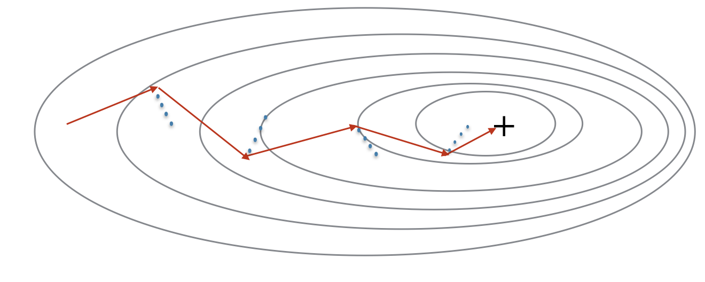
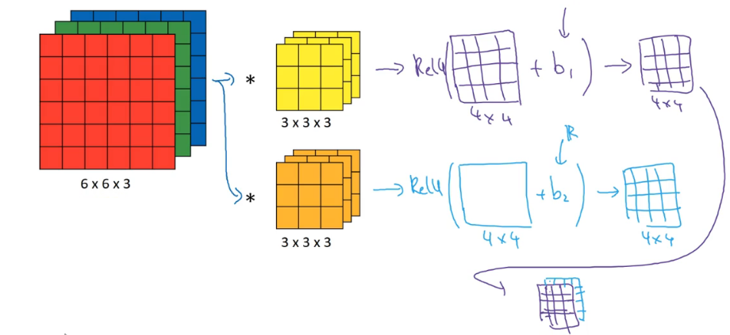

# Shallow Neural Network

## Introduction


对一条输入数据


$$
\begin{array}{l}{z^{[1]}=W^{[1]} x+b^{[1]}} \\ {a^{[1]}=\sigma\left(z^{[1]}\right)} \\ {z^{[2]}=W^{[2]} a^{[1]}+b^{[2]}} \\ {a^{[2]}=\sigma\left(z^{[2]}\right) = \hat{y}}\end{array}
$$
上标[1]、[2]等表示该变量是关于哪一层的变量，输入层是第0层，因此x也可表示为a^[0]^，从第一个hidden layer开始为第1层。

W,b分别是系数矩阵和偏置量，x是一条测试数据（列向量）。

定义
$$
X = (x^{(1)}, x^{(2)}, ..., x^{(m)}) \\
Z = (z^{(1)}, z^{(2)}, ..., z^{(m)}) \\
A = (a^{(1)}, a^{(2)}, ..., a^{(m)})
$$
向量化后为
$$
\begin{array}{l}{Z^{[1]}=W^{[1]} X+b^{[1]}} \\ {A^{[1]}=\sigma\left(Z^{[1]}\right)} \\ {Z^{[2]}=W^{[2]} A^{[1]}+b^{[2]}} \\ {A^{[2]}=\sigma\left(Z^{[2]}\right)}\end{array}
$$

预测值A^[2]^是行向量。

> $$
> \sigma(z) = \frac{1}{1 + e^{-z}} \\
> \sigma'(z) = \sigma(z)[1-\sigma(z)]
> $$


## Activation function

在激活函数的选择上，除了sigmoid函数以外，还可以选择其它非线性函数

- tanh函数 (双曲正切函数)
  $$
  a = g(z) = \text{tanh}(z) = \frac{e^z - e^{-z}}{e^z + e^{-z}}
  $$
  
  
  > $$
  > \text{tanh}'(z) = 1-\text{tanh}^2(z)
  > $$
  >
  > 
  
- 整流线性单元(rectify linear unit 或 ReLu)
  $$
  a = g(z) = max(0, z)
  $$
  

- Leaky ReLu
  $$
  a = g(z) = max(0.01z, z)
  $$
  

  系数0.01可以指定为远小于1的其它数


神经网络中的不同层的节点，可以分别使用不同的激活函数

只有在逻辑回归问题中的输出层节点通常使用sigmoid函数，在hidden layer通常使用ReLu函数。

ReLu函数和Leaky ReLu函数在0点处的导数值可以规定为其右极限或左极限中的任意一个值。

> 为什么一定要用非线性函数作为激活函数？
>
> 如果在所有hidden layer都使用线性激活函数，那么整个神经网络就将会退化为不含任何hidden layer的模型。如果在任一hidden layer使用线性激活函数，那么就相当于该层的前后两层是直接相连的。


## Back Propagation


# Deep Neural Network

$$
\begin{array}{l}{d Z^{[L]}=A^{[L]}-Y} \\ {d W^{[L]}=\frac{1}{m} d Z^{[L]} A^{[L-1]^{T}}} \\ {d b^{[L]}=\frac{1}{m} n p . s u m\left(d Z^{[L]}, \text { axis }=1, \text { keepdims }=\text { True }\right)} \\ {d Z^{[L-1]}=W^{[L]^{T}} d Z^{[L]} * g^{(L-1]}\left(Z^{[L-1]}\right)} \\ \vdots \\ {d Z^{[1]}=W^{[2]} d Z^{[2]} * g^{\{[1]}\left(Z^{[1]}\right)} \\ {d W^{[1]}=\frac{1}{m} d Z^{[1]} A^{[0]^{T}}} \\ d b^{[1]}=\frac{1}{m} n p . s u m\left(d Z^{[1]}, a x i s=1, \text { keepdims }=\text { True }\right)\end{array}
$$

Note that * denotes element-wise multiplication)

Note that $A^{[0]^T}$ is another way to denote the input features, which is also written as $X^T$


# Improving Deep Neural Networks

## L2 Regularization

The standard way to avoid overfitting is called **L2 regularization**. It consists of appropriately modifying your cost function, from:
$$J = -\frac{1}{m} \sum\limits_{i = 1}^{m} \large{(}\small  y^{(i)}\log\left(a^{[L](i)}\right) + (1-y^{(i)})\log\left(1- a^{[L](i)}\right) \large{)}$$
To:
$$J_{regularized} = \small \underbrace{-\frac{1}{m} \sum\limits_{i = 1}^{m} \large{(}\small y^{(i)}\log\left(a^{[L](i)}\right) + (1-y^{(i)})\log\left(1- a^{[L](i)}\right) \large{)} }_\text{cross-entropy cost} + \underbrace{\frac{1}{m} \frac{\lambda}{2} \sum\limits_l\sum\limits_k\sum\limits_j W_{k,j}^{[l]2} }_\text{L2 regularization cost}$$

Of course, because you changed the cost, you have to change backward propagation as well! All the gradients have to be computed with respect to this new cost.

- The cost computation:
  A regularization term is added to the cost
- The backpropagation function:
  There are extra terms in the gradients with respect to weight matrices
- Weights end up smaller ("weight decay"):
  Weights are pushed to smaller values.
- 

## Dropout Regularization

最常用的是反向随机失活算法

在进行训练，执行正向和反向传播算法时，对于每一条训练样例（每一个example），在神经网络的每一层随机敲除若干个结点，并连带去除其对应的输入输出，让该样例在这样一个简化后的神经网络上训练；然后对于下一条样例再执行一次这个随机处理过程，在这样处理后的另一个简化版神经网络上训练。

处理完所有样例后，完成一次迭代。对于每一次迭代，都要进行该随机处理过程。

例如：

对于第l层，keep_prob = 0.8 (表示第l层上的每一个结点有0.8的概率保留，0.2的概率被敲除)

生成一个随机的矩阵Dl（每一列对应一个样例）,表示相应位置的结点保留（1）或敲除（0）

Dl = np.random.rand(Al.shape[0], Al.shape[1])

Dl = (Dl < keep_prob).astype(int)

将Dl=0对应位置上的Al元素置为0

Al = np.multiply(Al, Dl)

为了在正向传播时，不改变预测结果的期望值，需要保持Al总体的期望保持不变，剩下的全体元素除以keep_prob

Al /= keep_prob

在正向和反向传播时都需要在随机处理过后的简化神经网络上进行

Backpropagation with dropout is actually quite easy. You will have to carry out 2 Steps:

- You had previously shut down some neurons during forward propagation, by applying a mask  D[1]D[1]  to A1. In backpropagation, you will have to shut down the same neurons, by reapplying the same mask  D[1]D[1]  to dA1.
- During forward propagation, you had divided A1 by keep_prob. In backpropagation, you'll therefore have to divide dA1 by keep_prob again (the calculus interpretation is that if  A[1]A[1]  is scaled by keep_prob, then its derivative  dA[1]dA[1]  is also scaled by the same keep_prob).

注意：在测试预测时，不使用该随机敲除的过程，即和正常的正向传播算法完全相同。

- Dropout is a regularization technique.
- You only use dropout during training. Don't use dropout (randomly eliminate nodes) during test time.
- Apply dropout both during forward and backward propagation.
- During training time, divide each dropout layer by keep_prob to keep the same expected value for the activations. 


## How to Understand Dropout

随机失活算法本质上是避免训练过程依赖某几个特征参数来实现代价函数的下降，而迫使对代价函数下降的“贡献”尽可能地分散在各个特征参数上。

和正则化（regularization）是起到相同的效果，将“贡献”分散后也就会起到减小正则化项（平方项）的作用。但随机失活算法更加具有自适应性。

在选择keep_prob时，对于单元数多的层取较小的keep_prob，对单元数少的层取较大的keep_prob甚至取1，对第0层（即输入层）取keep_prob=1

随机失活算法的缺点是会让debug无法进行，因为每次训练所用的网络都不能再现，代价函数的定义是具有随机性的。办法是在debug时关闭随机失活（keep_prob全取1），debug完后再开启。


## Vanishing / Exploding gradients

由于网络很深（L很大），并且由于Relu激活函数的使用，当权重矩阵W中的元素普遍大于1时，梯度会以L次幂指数级增加，即为梯度爆炸；反之，当权重矩阵W中的元素普遍小于1时，梯度会以(-L)次幂指数级减小，即为梯度消失。

以目前的技术无法消除梯度爆炸和梯度消失现象，但可以通过合理的权重值初始化，尽可能减缓这些问题。

当忽略b的影响时
$$
z = w_1x_1+w_2x_2+\dots+w_nx_n
$$
令w~n~的方差
$$
\text{var}(w_n)=\frac{1}{n}
$$
即标准差
$$
\text{std}(w_n)=\sqrt{\frac{1}{n}}
$$


则当 $\text{var}(x_n)=1$ 时（通过归一化来实现），$\text{var}(z)=1$，这就保持了方差不扩大，最终损失函数的方差也就不扩大

在实际初始化W时，如果使用的Relu函数，则令方差为2/n
$$
W^{[l]}=np.random.randn(shape) * np.sqrt(2/n^{[l-1]})
$$
即“He. initialization”

如果使用的是tanh函数，则令方差为1/n，又称为Xavier initialization.

- Different initializations lead to different results
- Random initialization is used to break symmetry and make sure different hidden units can learn different things
- Don't intialize to values that are too large
- He. initialization works well for networks with ReLU activations.


## Optimization Algorithms

简单的梯度下降算法训练的速度还比较慢，可以用其它更先进的优化算法。好的优化算法可能使原本几天完成的训练过程在几个小时内完成

**Notations**: As usual, $\frac{\partial J}{\partial a } = $ `da` for any variable `a`.

### Mini-Batch Gradient descent

之前的梯度下降算法过程中，每次迭代会输入整个数据集，称为Batch Gradient descent；而Mini-Batch Gradient descent 就是一次迭代只输入其中k条数据，k一般取64,128,256,512等。

此外，还有一种极端的做法，一次迭代只输入1条数据，称为Stochastic gradient descent，一般不会使用。

- The difference between gradient descent, mini-batch gradient descent and stochastic gradient descent is the number of examples you use to perform one update step.
- You have to tune a learning rate hyperparameter $\alpha$.
- With a well-turned mini-batch size, usually it outperforms either gradient descent or stochastic gradient descent (particularly when the training set is large).

Build mini-batches from the training set (X, Y). There are two steps:

- **Shuffle**: Create a shuffled version of the training set (X, Y) as shown below. Each column of X and Y represents a training example. Note that the random shuffling is done synchronously between X and Y. Such that after the shuffling the $i^{th}$ column of X is the example corresponding to the $i^{th}$ label in Y. The shuffling step ensures that examples will be split randomly into different mini-batches. 


    permutation = list(np.random.permutation(m))
    shuffled_X = X[:, permutation]
    shuffled_Y = Y[:, permutation].reshape((1,m))
- **Partition**: Partition the shuffled (X, Y) into mini-batches of size `mini_batch_size` (here 64). Note that the number of training examples is not always divisible by `mini_batch_size`. The last mini batch might be smaller, but you don't need to worry about this.

```
num_complete_minibatches = math.floor(m/mini_batch_size)
for k in range(0, num_complete_minibatches):
    mini_batch_X = shuffled_X[:, k * mini_batch_size : (k + 1) * mini_batch_size]
    mini_batch_Y = shuffled_Y[:, k * mini_batch_size : (k + 1) * mini_batch_size]
    mini_batch = (mini_batch_X, mini_batch_Y)
    mini_batches.append(mini_batch)

# Handling the end case (last mini-batch < mini_batch_size)
if m % mini_batch_size != 0:
    mini_batch_X = shuffled_X[:, num_complete_minibatches * mini_batch_size :]
    mini_batch_Y = shuffled_Y[:, num_complete_minibatches * mini_batch_size :]
    mini_batch = (mini_batch_X, mini_batch_Y)
    mini_batches.append(mini_batch)
```


### Exponentially weighted averages

在一些高级的优化算法中经常要求均值，一般会使用更高效的求均值算法。

指数加权平均是一种近似计算平均值的online算法，空间复杂度只有O(1)

对于一组数据$ x_1, x_2, x_3, ..., x_n $，按如下方式计算$v_t$
$$
\begin{aligned}
& v_0 = 0 \\
& v_1 = 0.9 v_0 + 0.1x_1 \\
& v_2 = 0.9 v_1 + 0.1x_2 \\
& \dots \\
& v_n = 0.9 v_{n-1} + 0.1x_n
\end{aligned}
$$
即
$$
v_t = \beta v_{t-1} + (1-\beta)x_t
$$
则$v_t$近似为前$\frac{1}{1-\beta}$个x值的平均值，如果蓝色数据点表示x，红色数据点表示v


- 偏差修正

实际上述计算出的的近似均值点v的前10个点（更一般地，前$\frac{1}{1-\beta}$个点），距离真实的均值相差较大，可使用以下算法修正：
$$
v_t := \frac{v_t}{1-\beta^t}
$$

### Momentum

Because mini-batch gradient descent makes a parameter update after seeing just a subset of examples, the direction of the update has some variance, and so the path taken by mini-batch gradient descent will "oscillate" toward convergence. Using momentum can reduce these oscillations.

Momentum takes into account the past gradients to smooth out the update. We will store the 'direction' of the previous gradients in the variable $v$. Formally, this will be the exponentially weighted average of the gradient on previous steps. You can also think of $v$ as the "velocity" of a ball rolling downhill, building up speed (and momentum) according to the direction of the gradient/slope of the hill. 


The red arrows shows the direction taken by one step of mini-batch gradient descent with momentum. The blue points show the direction of the gradient (with respect to the current mini-batch) on each step. Rather than just following the gradient, we let the gradient influence $v$ and then take a step in the direction of $v$.
$$
\begin{aligned}
&v_{dW} = 0 \\
&v_{db} = 0 \\
&\text{on iteration t:} \\
& \quad \text{for} \quad l = 1, ..., L: \\
& \quad \text{compute dW, db on curren mini-batch} \\
& \quad v_{dW^{[l]}} = \beta v_{dW^{[l]}} + (1 - \beta) dW^{[l]}  \\
& \quad v_{db^{[l]}} = \beta v_{db^{[l]}} + (1 - \beta) db^{[l]}  \\
& \quad W^{[l]} = W^{[l]} - \alpha v_{dW^{[l]}} \\
& \quad b^{[l]} = b^{[l]} - \alpha v_{db^{[l]}}  \\
\end{aligned}
$$
**Note** that:
- The velocity is initialized with zeros. So the algorithm will take a few iterations to "build up" velocity and start to take bigger steps.
- If $\beta = 0$, then this just becomes standard gradient descent without momentum. 

**How do you choose $\beta$?**

- The larger the momentum $\beta$ is, the smoother the update because the more we take the past gradients into account. But if $\beta$ is too big, it could also smooth out the updates too much. 
- Common values for $\beta$ range from 0.8 to 0.999. If you don't feel inclined to tune this, $\beta = 0.9$ is often a reasonable default. 
- Tuning the optimal $\beta$ for your model might need trying several values to see what works best in term of reducing the value of the cost function $J$. 

### RMS prop

方均根传播是另一种加速梯度下降的算法。

考虑代价函数的梯度，在下降过程中，沿某个方向x的梯度分量很小，而沿另一个方向y的梯度分量很大，我们希望每一次迭代沿x方向多走一点，沿y方向少走一点。

方均根传播是将前几次下降过程中的梯度各分量的方均根算出来，根据该方均根值调整下降的步长：
$$
\begin{aligned}
&S_{dW} = 0 \\
&S_{db} = 0 \\
&\text{on iteration t:} \\
& \quad \text{for} \quad l = 1, ..., L: \\
& \quad \text{compute dW, db on curren mini-batch} \\
& \quad S_{dW^{[l]}} = \beta S_{dW^{[l]}} + (1 - \beta) (dW^{[l]})^2  \\
& \quad S_{db^{[l]}} = \beta S_{db^{[l]}} + (1 - \beta) (db^{[l]})^2  \\
& \quad W^{[l]} = W^{[l]} - \alpha \frac{dW^{[l]}}{\sqrt{S_{dW^{[l]}}}} \\
& \quad b^{[l]} = b^{[l]} - \alpha \frac{db^{[l]}}{\sqrt{S_{db^{[l]}}}}  \\
\end{aligned}
$$

$\beta$通常取0.999.

为了避免除0错误，通常会在上述分母上加一个非常小的值$\epsilon$，通常为1e-8，该值通常不需要调参，对性能没有影响。


### Adam Optimization Algorithm

实际工作更多使用的是将动量算法和该方均根传播算法相结合的Adam算法（自适应矩估计算法）。

**How does Adam work?**
1. It calculates an exponentially weighted average of past gradients, and stores it in variables $v$ (before bias correction) and $v^{corrected}$ (with bias correction). 
2. It calculates an exponentially weighted average of the squares of the past gradients, and  stores it in variables $s$ (before bias correction) and $s^{corrected}$ (with bias correction). 
3. It updates parameters in a direction based on combining information from "1" and "2".

The update rule is, for $l = 1, ..., L$: 

$$\begin{cases}
v_{dW^{[l]}} = \beta_1 v_{dW^{[l]}} + (1 - \beta_1) \frac{\partial \mathcal{J} }{ \partial W^{[l]} } \\
v^{corrected}_{dW^{[l]}} = \frac{v_{dW^{[l]}}}{1 - (\beta_1)^t} \\
s_{dW^{[l]}} = \beta_2 s_{dW^{[l]}} + (1 - \beta_2) (\frac{\partial \mathcal{J} }{\partial W^{[l]} })^2 \\
s^{corrected}_{dW^{[l]}} = \frac{s_{dW^{[l]}}}{1 - (\beta_2)^t} \\
W^{[l]} = W^{[l]} - \alpha \frac{v^{corrected}_{dW^{[l]}}}{\sqrt{s^{corrected}_{dW^{[l]}}} + \varepsilon}
\end{cases}$$
where:
- t counts the number of steps taken of Adam 
- L is the number of layers
- $\beta_1$ and $\beta_2$ are hyperparameters that control the two exponentially weighted averages. 
- $\alpha$ is the learning rate
- $\varepsilon$ is a very small number to avoid dividing by zero, always be 1e-8

db也做同样处理.


### The problem of local optima

通常所谓的局部最优点出现的概率不高，一般出现的是“鞍点”。

因为神经网络的参数向量一般是一个非常高维的向量，当梯度达到0时，局部最优点要在所有维度上的分量都是凹函数时才会出现，概率很低；而一部分维度上的分量为凸函数，另一部分分量为凹函数时，为“鞍点”。

如果出现接近某一鞍点时，某一维度方向上的梯度很小，会花很长的时间才能跨过。

使用Adam优化算法能加速跨过这种鞍点的过程。


## Learning Rate Decay

可以在训练的过程中逐渐减小学习速率，使得一开始可以使用较大的学习速率，以下是若干个学习速率衰减策略:

(1 epoch = 1 pass through the whole data set)

- 

$$
\alpha = \dfrac{1}{1+DecayRate*EpochNum}\alpha_0
$$

- 

$$
\alpha = 0.95^{EpochNum}\alpha_0
$$

- t is the number of mini-batches

$$
\alpha=\left\{ 
\begin{align}
&\alpha_1 & 0 \le t < t_1 \\
&\alpha_2 & t_1 \le t < t_2 \\
& \vdots
\end{align}
\right.
$$

- change learning rate manually


## Batch Normalization

一般的归一化是仅针对输入层数据的归一化，使输入数据符合均值0方差1的分布。

批量归一化是对所有隐藏层的归一化，使出入下一层的激活值均值0方差1，可以加速训练过程。

批量归一化作用于 $z^{[l](i)}$ 上。首先和输入层的归一化一样，计算所有数据在该位置上的激活值的均值和方差，减去均值，除以标准差。为了防止除0错误，分母上有个加$\epsilon$的项，一般取1e-8。

（以下均针对第l层，式中省略[l]上标）
$$
\begin{aligned}
& \mu = \dfrac{1}{m}\sum_iz^{(i)} \\
& \sigma^2 = \dfrac{1}{m}\sum_i(z^{(i)} - \mu)^2 \\
& z_{norm}^{(i)}=\dfrac{z^{(i)}-\mu}{\sqrt{\sigma^2+\epsilon}} \\
\end{aligned}
$$
虽然将z的值进行了归一化，但为了使模型代价最小，需要每一层的激活值分布有其它的均值和标准差，因此再对归一化后的值改变为某种均值-标准差分布
$$
\tilde{z}^{(i)} = \gamma z_{norm}^{(i)}+\beta
$$
其中 $\gamma,\beta$ 均为模型参数，和W,b一样，通过优化算法（梯度下降，Adam等）来迭代更新

通过学习到不同的 $\gamma,\beta$ 值，来控制该位置的z值的均值和标准差分别为$\gamma,\beta$。


### Fitting Batch Norm into a Neural Network

- 使用mini-batch时，均值，方差的计算都是一个针对这一个mini-batch的
- 正向传播时，忽略b，即令b=0。因为z中的每一个值$z_i$都会减去各自的均值$\mu_i$，因此无论b是多少结果都一样。同样，反向传播时也忽略db。
- 反向传播时，相应的导数也要变化，主要是多了$d\gamma, d\beta$，少了db。
- 以上Batch Norm步骤，将z进行的一系列处理，与没有引入Batch Norm时比，可以看作是对$a^{[l-1]} \rightarrow z^{[l]}$ 映射关系的修改，修改后的映射仍为线性关系，只不过引入了新的学习参数$\gamma,\beta$。
- 当使用该模型进行预测时，输入是单一一条数据，均值方差怎么确定？应该使用训练过程中各个mini-batch产生的均值方差的指数加权平均值，在训练过程中就计算并记录下来该值。


**Why does Batch Norm work**

批量归一化减小了较前的层中数据变化对较后的层的影响。

在训练过程中，前层的数据发生变化，由于批量归一化的作用，后层的数据仍然被限定到特定的概率分布中，使得后层已经训练出的结果不需要做太大的变动。

使得各层的训练独立性增加。


## Multi-class classification

逻辑回归用于产生0,1两种结果的分类，当面对多分类问题时，虽然可以训练多个逻辑回归结点，更好的选择是使用softmax激活函数。

首先将z送入e指数函数处理，再计算各分量占所有分量和的比例，即
$$
a^{[L]} = \dfrac{e^{z^{[L]}}}{\sum_ie^{z^{[L]}_i}}
$$

### Loss Function

数据标记（一条数据）：1表示所属类别为该位置对应的类
$$
y = [0, 0, ...,0, 1, 0, ...,0]
$$
预测向量
$$
\hat{y} = a^{[L]}
$$
损失函数 
$$
L(\hat{y}, y) = -\sum_i y_i \log \hat{y}_i
$$
整个数据集的损失函数
$$
J(W^{[1]},b^{[1]},...) = \frac{1}{m}\sum_j^mL(\hat{y}, y) 
$$

### Gradient descent

softmax激活函数求导
$$
\begin{aligned} \frac{\partial L}{\partial z_{i}}=&-\sum_{k} y_{k} \frac{\partial \log \hat{y}_{k}}{\partial z_{i}}=-\sum_{k} y_{k} \frac{1}{\hat{y}_{k}} \frac{\partial \hat{y}_{k}}{\partial z_{i}} \\=&-y_{i}\left(1-\hat{y}_{i}\right)-\sum_{k \neq i} y_{k} \frac{1}{\hat{y}_{k}}\left(-\hat{y}_{k} \hat{y}_{i}\right) \\ &=-y_{i}\left(1-\hat{y}_{i}\right)+\sum_{k \neq i} y_{k}\left(\hat{y}_{i}\right) \\ &=-y_{i}+y_{i} \hat{y}_{i}+\sum_{k \neq i} y_{k}\left(\hat{y}_{i}\right) \\=& \hat{y}_{i}\left(\sum_{k} y_{k}\right)-y_{i}=\hat{y}_{i}-y_{i} \end{aligned}
$$
即
$$
dZ^{[L]}=\frac{1}{m}(\hat{Y} - Y)
$$


# Convolutional Neural Networks

> **Notation**:
> - Superscript $[l]$ denotes an object of the $l^{th}$ layer. 
>     - Example: $a^{[4]}$ is the $4^{th}$ layer activation. $W^{[5]}$ and $b^{[5]}$ are the $5^{th}$ layer parameters.
>
>
> - Superscript $(i)$ denotes an object from the $i^{th}$ example. 
>     - Example: $x^{(i)}$ is the $i^{th}$ training example input.
>    
> - Subscript $i$ denotes the $i^{th}$ entry of a vector.
>     - Example: $a^{[l]}_i$ denotes the $i^{th}$ entry of the activations in layer $l$, assuming this is a fully connected (FC) layer.
>    
> - $n_H$, $n_W$ and $n_C$ denote respectively the height, width and number of channels of a given layer. If you want to reference a specific layer $l$, you can also write $n_H^{[l]}$, $n_W^{[l]}$, $n_C^{[l]}$. 
> - $n_{H_{prev}}$, $n_{W_{prev}}$ and $n_{C_{prev}}$ denote respectively the height, width and number of channels of the previous layer. If referencing a specific layer $l$, this could also be denoted $n_H^{[l-1]}$, $n_W^{[l-1]}$, $n_C^{[l-1]}$. 


## Edge Detection

深度学习中的“卷积”运算与数字信号处理中的“卷积”定义不同，省略了水平垂直翻转操作，即相当于cross-correlation运算（加权求和）。

卷积运算符右侧的矩阵称为“core”或“filter”或"window"

常用的边缘检测核：

- 垂直边缘$\begin{bmatrix} 1 & 0 & -1 \\ 1 & 0 & -1 \\ 1 & 0 & -1\end{bmatrix}$， 水平边缘$\begin{bmatrix} 1 & 1 & 1 \\ 0 & 0 & 0 \\ -1 & -1 & -1\end{bmatrix}$

- 垂直边缘$\begin{bmatrix} 1 & 0 & -1 \\ 2 & 0 & -2 \\ 1 & 0 & -1\end{bmatrix}$ ，水平边缘$\begin{bmatrix} 1 & 2 & 1 \\ 0 & 0 & 0 \\ -1 & -2 & -1\end{bmatrix}$，sobel filter
- 垂直边缘$\begin{bmatrix} 3 & 0 & -3 \\ 10 & 0 & -10 \\ 3 & 0 & -3\end{bmatrix}$，水平边缘$\begin{bmatrix} 3 & 10 & 3 \\ 0 & 0 & 0 \\ -3 & -10 & -3\end{bmatrix}$，scharr filter

$边缘提取结果=\sqrt{垂直边缘提取结果^2 + 水平边缘提取结果^2}$


## Padding

若原图大小为n x n，过滤器大小为f x f，则卷积结果为(n-f+1) x (n-f+1)，如果要保持卷积运算结果和原图大小相同，需要在原图周围用0填充，填充的边缘宽度为p

例如原图大小为6 x 6，p=1，则填充后的图大小为8 x 8

考虑填充的情况，卷积运算结果的大小为n+2p-f+1

- Valid convolutions: 填充为0的卷积运算
- Same convolutions: 适当填充使得卷积运算结果与原图大小相同的卷积运算

注：通常过滤器的大小选择为长宽均为奇数的方阵

The main benefits of padding are the following:

- It allows you to use a CONV layer without necessarily shrinking the height and width of the volumes. This is important for building deeper networks, since otherwise the height/width would shrink as you go to deeper layers. An important special case is the "same" convolution, in which the height/width is exactly preserved after one layer. 
- It helps us keep more of the information at the border of an image. Without padding, very few values at the next layer would be affected by pixels as the edges of an image.


## Strided Convolutions

通常的卷积运算，过滤器在原图上的移动为从左到右，从上到下，一次一移动1格。

带步长的卷积运算，过滤器的移动为一次移动s格（若移动后超出原图范围，则不进行此次移动）

带步长的卷积运算，结果的大小为：
$$
\lfloor \dfrac{n + 2p - f}{s} + 1 \rfloor \times \lfloor \dfrac{n + 2p - f}{s} + 1 \rfloor
$$


## Convolutions Over Volume

对于RGB图像，有3个通道，卷积与需要在三个通道上同时进行

对于通道数为n~c~的输入，使用的过滤器大小应该为f x f x n~c~，过滤器不同通道的值不一定相同

过滤器在卷积的过程中，每移动一次，产生一个数，为f x f x n~c~个数与对应输入中的值加权后的总和

例如：

对于6 x 6 x 3的输入，用3 x 3 x 3的过滤器，产生结果大小为4 x 4

可以依次使用n~f~个过滤器处理输入，每个过滤器的大小均相同，产生多个相同大小的结果，多个结果层叠（stack）在一起，形成一个n~f~个通道的输出

例如：

对于6 x 6 x 3的输入，用2个3 x 3 x 3的过滤器，产生结果大小为4 x 4 x 2


## One Layer of a Convolutional Network

将每一个过滤器产生的卷积结果，加上偏置值b，送入ReLu函数处理，输出一个结果。

将所有过滤器产生的结果如此处理后，层叠（stack）在一起，形成n~f~通道的输出。



所有过滤器中的值，偏置值，都是需要通过学习得到的参数

学习参数的个数：

例如有10个大小为3 x 3 x 3的过滤器，则这一层的变量个数为:

(3 x 3 x 3 + 1) x 10 = 280


## Pooling Layers

- Max Pooling（常用）

过滤器在移动过程中不是加权求和，而是求最大值


- Average Pooling

不是求最大值，而是求平均值


注：池化层没有学习参数，只有超参数

- f: filter size

- s: stride

- Max or average pooling


## Fully Connected Layer (FC)

就是将输入展开为一维向量，与输出的激活值做全连接，即与经典神经网络层相同

z = Wx + b

a = g(z)


## CNN Example


注：

- 通常将conv-pool的组合看作一层
- 池化层相当于经典神经网络中的ReLu函数的作用
- 通常随着层数的深入，通道数逐渐增大，长宽逐渐减小，最后是全连接层


## Advantages of CNN

- Parameter sharing: A feature detector (such as a vertical edge detector) that 's useful in one part of the image is probably useful in another part of the image.
- Sparsity of connecions: In each layer, each output value depends only on a small number of inputs.


## Batch Normalization of CNN

之前所说的对于经典神经网络的batch normalization，是每一个units/neurons在所有m个数据上平均/求方差。即：对于n个units，需要学习n组$\gamma,\beta$ 

而对于CNN，是每一个channel，在所有m * H * W个数值是求平均/方差。即：对于C个channel，需要学习C组$\gamma,\beta$ 。

理解：

原则是对每一个feature，在其生成的所有数据上求平均/方差。

对于CNN来说，一个channel上的H * W个值都是由同一个卷积核生成的，这H * W个数是一个feature生成的，如果有m张图，一个channel对应一个feature对应m * H * W个数。（对比于经典神经网络，仿佛是在m * H * W个数据上得到的一个激活值）


## Backpropagation in convolutional neural networks

In modern deep learning frameworks, you only have to implement the forward pass, and the framework takes care of the backward pass, so most deep learning engineers don't need to bother with the details of the backward pass. The backward pass for convolutional networks is complicated. 

### Computing dA:

This is the formula for computing $dA$ with respect to the cost for a certain filter $W_c$ and a given training example:

$$ dA += \sum _{h=0} ^{n_H} \sum_{w=0} ^{n_W} W_c \times dZ_{hw} \tag{1}$$

Where $W_c$ is a filter and $dZ_{hw}$ is a scalar corresponding to the gradient of the cost with respect to the output of the conv layer Z at the hth row and wth column (corresponding to the dot product taken at the ith stride left and jth stride down). Note that at each time, we multiply the the same filter $W_c$ by a different dZ when updating dA. We do so mainly because when computing the forward propagation, each filter is dotted and summed by a different a_slice. Therefore when computing the backprop for dA, we are just adding the gradients of all the a_slices. 

In code, inside the appropriate for-loops, this formula translates into:
```python
da_prev_pad[vert_start:vert_end, horiz_start:horiz_end, :] += W[:,:,:,c] * dZ[i, h, w, c]
```

### Computing dW:

This is the formula for computing $dW_c$ ($dW_c$ is the derivative of one filter) with respect to the loss:

$$ dW_c  += \sum _{h=0} ^{n_H} \sum_{w=0} ^ {n_W} a_{slice} \times dZ_{hw}  \tag{2}$$

Where $a_{slice}$ corresponds to the slice which was used to generate the activation $Z_{ij}$. Hence, this ends up giving us the gradient for $W$ with respect to that slice. Since it is the same $W$, we will just add up all such gradients to get $dW$. 

In code, inside the appropriate for-loops, this formula translates into:
```python
dW[:,:,:,c] += a_slice * dZ[i, h, w, c]
```

### Computing db:

This is the formula for computing $db$ with respect to the cost for a certain filter $W_c$:

$$ db = \sum_h \sum_w dZ_{hw} \tag{3}$$

As you have previously seen in basic neural networks, db is computed by summing $dZ$. In this case, you are just summing over all the gradients of the conv output (Z) with respect to the cost. 

In code, inside the appropriate for-loops, this formula translates into:
```python
db[:,:,:,c] += dZ[i, h, w, c]
```

### Pooling Layer

- max pooling

  define the mask of window according to the shape of the filter such as:

$$
 X = \begin{bmatrix}
1 && 3 \\
4 && 2
\end{bmatrix} \quad \rightarrow  \quad M =\begin{bmatrix}
0 && 0 \\
1 && 0
\end{bmatrix}\tag{4}
$$

- average pooling

  define the mask of window according to the shape of the filter such as :
  $$
  M =\begin{bmatrix}
  1/4 && 1/4 \\
  1/4 && 1/4
  \end{bmatrix}\tag{5}
  $$
  let dA be the gradient of cost with respect to the output of the pooling layer, same shape as A, dA_prev the gradient of cost with respect to the input of the pooling layer, same shape as A_prev

```
dA_prev[i, vert_start: vert_end, horiz_start: horiz_end, c] += M * dA[i, h, w, c]
```


# Case of Networks

- LeNet-5


在池化层后有非线性处理，原文中用sigmoid/tanh而非relu

ref: LeCun et al., 1998. Gradient-based learning applied to document recognition

- AlexNet


相比LeNet-5有更大规模的参数，使用了relu函数进非线性处理

ref: Krizhevshy et. al., 2012. ImageNet classification with deep convolution neural networks

- VGG-16

CONV = 3x3 filter, s=1, same

MAX-POOL = 2x2, s=2


结构统一，卷积层数量倍增，通过池化层将长宽半数减小

ref: Simonyan & Zisserman 2015. Very deep convolutional networks for large-scale image recognition


## Resudual Networks

### The problem of very deep neural networkss

In recent years, neural networks have become deeper, with state-of-the-art networks going from just a few layers (e.g., AlexNet) to over a hundred layers.

* The main benefit of a very deep network is that it can represent very complex functions. It can also learn features at many different levels of abstraction, from edges (at the shallower layers, closer to the input) to very complex features (at the deeper layers, closer to the output). 
* However, using a deeper network doesn't always help. A huge barrier to training them is vanishing gradients: very deep networks often have a gradient signal that goes to zero quickly, thus making gradient descent prohibitively slow. 
* More specifically, during gradient descent, as you backprop from the final layer back to the first layer, you are multiplying by the weight matrix on each step, and thus the gradient can decrease exponentially quickly to zero (or, in rare cases, grow exponentially quickly and "explode" to take very large values). 
* During training, you might therefore see the magnitude (or norm) of the gradient for the shallower layers decrease to zero very rapidly as training proceeds: 


### Building a Residual Network

In ResNets, a "shortcut" or a "skip connection" allows the model to skip layers:  


The image on the left shows the "main path" through the network. The image on the right adds a shortcut to the main path. By stacking these ResNet blocks on top of each other, you can form a very deep network. 

Having ResNet blocks with the shortcut also makes it very easy for one of the blocks to learn an identity function. This means that you can stack on additional ResNet blocks with little risk of harming training set performance.  

(There is also some evidence that the ease of learning an identity function accounts for ResNets' remarkable performance even more so than skip connections helping with vanishing gradients).

Two main types of blocks are used in a ResNet, depending mainly on whether the input/output dimensions are same or different:  the "identity block" and the "convolutional block."

- The identity block

The identity block is the standard block used in ResNets, and corresponds to the case where the input activation (say $a^{[l]}$) has the same dimension as the output activation (say $a^{[l+2]}$). Here is an alternative diagram showing the individual steps:


The upper path is the "shortcut path." The lower path is the "main path." In this diagram, we have also made explicit the CONV2D and ReLU steps in each layer. To speed up training we have also added a BatchNorm step.

A slightly more powerful version of this identity block: the skip connection "skips over" 3 hidden layers rather than 2 layers. 


- The convolutional block

The ResNet "convolutional block" is the second block type. You can use this type of block when the input and output dimensions don't match up. The difference with the identity block is that there is a CONV2D layer in the shortcut path: 


* The CONV2D layer in the shortcut path is used to resize the input $x$ to a different dimension, so that the dimensions match up in the final addition needed to add the shortcut value back to the main path. 
* For example, to reduce the activation dimensions's height and width by a factor of 2, you can use a 1x1 convolution with a stride of 2. 
* The CONV2D layer on the shortcut path does not use any non-linear activation function. Its main role is to just apply a (learned) linear function that reduces the dimension of the input, so that the dimensions match up for the later addition step. 


### Why do residual networks work

Residual networks 可以很容易地训练与恒等函数关系，因此在网络深度很深时，也能保证至少不损害网络的整体性能


### A 50 layers ResNet model

The following figure describes in detail the architecture of this neural network. "ID BLOCK" in the diagram stands for "Identity block," and "ID BLOCK x3" means you should stack 3 identity blocks together.


The details of this ResNet-50 model are:
- Zero-padding pads the input with a pad of (3,3)
- Stage 1:
    - The 2D Convolution has 64 filters of shape (7,7) and uses a stride of (2,2). Its name is "conv1".
    - BatchNorm is applied to the 'channels' axis of the input.
    - MaxPooling uses a (3,3) window and a (2,2) stride.
- Stage 2:
    - The convolutional block uses three sets of filters of size [64,64,256], "f" is 3, "s" is 1 and the block is "a".
    - The 2 identity blocks use three sets of filters of size [64,64,256], "f" is 3 and the blocks are "b" and "c".
- Stage 3:
    - The convolutional block uses three sets of filters of size [128,128,512], "f" is 3, "s" is 2 and the block is "a".
    - The 3 identity blocks use three sets of filters of size [128,128,512], "f" is 3 and the blocks are "b", "c" and "d".
- Stage 4:
    - The convolutional block uses three sets of filters of size [256, 256, 1024], "f" is 3, "s" is 2 and the block is "a".
    - The 5 identity blocks use three sets of filters of size [256, 256, 1024], "f" is 3 and the blocks are "b", "c", "d", "e" and "f".
- Stage 5:
    - The convolutional block uses three sets of filters of size [512, 512, 2048], "f" is 3, "s" is 2 and the block is "a".
    - The 2 identity blocks use three sets of filters of size [512, 512, 2048], "f" is 3 and the blocks are "b" and "c".
- The 2D Average Pooling uses a window of shape (2,2) and its name is "avg_pool".
- The 'flatten' layer doesn't have any hyperparameters or name.
- The Fully Connected (Dense) layer reduces its input to the number of classes using a softmax activation. 


ref: He et al., 2015. Deep residual networks for image recognition

Kaiming He, Xiangyu Zhang, Shaoqing Ren, Jian Sun. Deep Residual Learning for Image Recognition


## Inception Network

在一个Layer中同时使用多种卷积核，将产生的所有结果堆叠在一起，形成一个Volume


为了减小计算所需要的成本，会利用1x1卷积

1x1卷积就是使用1x1xC大小的卷积核，可以用于减小Volume的通道个数n_C

在Inception Network中，对于需要进行卷积运算的地方，先进行一次1x1卷积运算减小n_C，再用原来的卷积核进行运算：


### Actual Inception Network Block


ref: Szegedy et al., 2014. Going Deeper with Convolutions


