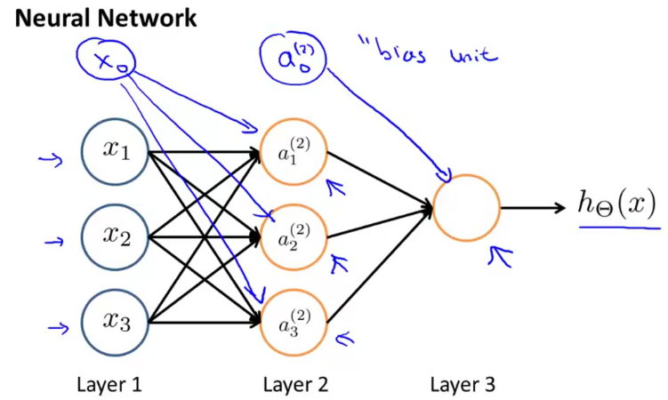
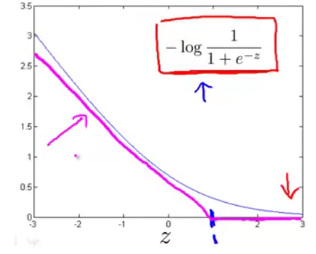
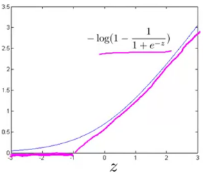
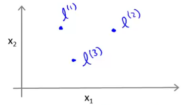
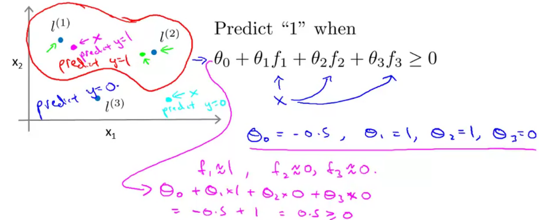

# Introduction

- two broad classifications:
  - Supervised learning and Unsupervised learning


## Supervised Learning

- definition:

  data set called "right answers" are given

- category:

  - regression problem（回归问题）

    map input variables to some continuous function

  - classification problem

    map input variables into discrete categories


## Unsupervised Learning

​    unlabled data set

​    We can derive this structure by clustering the data based on relationships among the variables in the data

- examples:
  - Clustering: Take a collection of 1,000,000 different genes, and find a way to automatically group these genes into groups that are somehow similar or related by different variables, such as lifespan, location, roles, and so on.
  - Non-clustering: The "Cocktail Party Algorithm", allows you to find structure in a chaotic environment. (i.e. identifying individual voices and music from a mesh of sounds at a [cocktail party](https://en.wikipedia.org/wiki/Cocktail_party_effect)).


# Linear Regression

- Univariate linear regression

  Linear regression with one variable

## Linear Regression with one variable

### Cost Function

We can measure the accuracy of our hypothesis function by using a **cost function**.
$$
J(\theta_0,\theta_1)=\frac{1}{2m}\sum_{i=1}^{m}(h_\theta(x_i)-y_i)^2
$$
This function is otherwise called the "Squared error function", or "Mean squared error". The mean is halved $\left(\frac{1}{2}\right)$as a convenience for the computation of the gradient descent, as the derivative term of the square function will cancel out the$ \frac{1}{2}$ term.

hypothesis:
$$
h_\theta(x)=\theta_0+\theta_1x
$$
parameters:
$$
\theta_0, \theta_1
$$
Cost Function:
$$
J(\theta_0,\theta_1)=\frac{1}{2m}\sum_{i=1}^{m}(h_\theta(x_i)-y_i)^2
$$
Goal:
$$
\min_{\theta_0,\theta_1}J(\theta_0,\theta_1)
$$


### Gradient Descent

Find the local minimum point of the cost function

1. 选定一个初始点$(\theta_0^{(0)},\theta_1^{(0)})$

2. 沿$\nabla{J(\theta_0,\theta_1)}$的反方向移动一段距离（受$\alpha$，称为学习速率，的控制）到$(\theta_0^{(1)},\theta_1^{(1)})$，重复直到收敛

The gradient descent algorithm is:

repeat until convergence:
$$
\theta_j:=\theta_j-\alpha\frac{\partial}{\partial\theta_0}J(\theta_0,\theta_1)
$$
where j=0,1 represents the feature index number.

Regardless of the slope's sign for $\frac{d}{d\theta_1}$ , $\theta_1$eventually converges to its minimum value. 

As we approach a local minimum, gradient descent will automatically take smaller steps. So, no need to decrease α over time.


> In our univariate linear regression
> $$
\begin{align*} \text{repeat until convergence: } \lbrace & \newline \theta_0 := & \theta_0 - \alpha \frac{1}{m} \sum\limits_{i=1}^{m}(h_\theta(x_{i}) - y_{i}) \newline \theta_1 := & \theta_1 - \alpha \frac{1}{m} \sum\limits_{i=1}^{m}\left((h_\theta(x_{i}) - y_{i}) x_{i}\right) \newline \rbrace& \end{align*}
> $$
> This method looks at every example in the entire training set on every step, and is called **batch gradient descent**.


## Multivariate Linear Regression

### Multiple Features

Linear regression with multiple variables is also known as "multivariate linear regression".
$$
\begin{align*}x_j^{(i)} &= \text{value of feature } j \text{ in the }i^{th}\text{ training example} \newline x^{(i)}& = \text{the input (features) of the }i^{th}\text{ training example} \newline m &= \text{the number of training examples} \newline n &= \text{the number of features} \end{align*}
$$
The multivariable form of the hypothesis function accommodating these multiple features is as follows:
$$
h_\theta (x) = \theta_0 + \theta_1 x_1 + \theta_2 x_2 + \theta_3 x_3 + \cdots + \theta_n x_n
$$
let $x_{0}^{(i)} =1 \text{ for } (i\in { 1,\dots, m } )$, we can represent our pypothesis function as:
$$
\begin{align*}h_\theta(x) =\begin{bmatrix}\theta_0 \hspace{2em} \theta_1 \hspace{2em} ... \hspace{2em} \theta_n\end{bmatrix}\begin{bmatrix}x_0 \newline x_1 \newline \vdots \newline x_n\end{bmatrix}= \theta^T x\end{align*}
$$

### Gradient Descent for Multiple Variables

cost function is as same as previous one variable example:
$$
J(\theta)=J(\theta_0,\theta_1,...,\theta_n)=\frac{1}{2m}\sum_{i=1}^{m}(h_\theta(x_i)-y_i)^2
$$
where θ is a n-dimension vector.

gradient descent algorithm becomes:
$$
\begin{align*} & \text{repeat until convergence:} \; \lbrace \newline \; & \theta_0 := \theta_0 - \alpha \frac{1}{m} \sum\limits_{i=1}^{m} (h_\theta(x^{(i)}) - y^{(i)}) \cdot x_0^{(i)}\newline \; & \theta_1 := \theta_1 - \alpha \frac{1}{m} \sum\limits_{i=1}^{m} (h_\theta(x^{(i)}) - y^{(i)}) \cdot x_1^{(i)} \newline \; & \theta_2 := \theta_2 - \alpha \frac{1}{m} \sum\limits_{i=1}^{m} (h_\theta(x^{(i)}) - y^{(i)}) \cdot x_2^{(i)} \newline & \cdots \newline \rbrace \end{align*}
$$
In other words:
$$
\begin{align*}& \text{repeat until convergence:} \; \lbrace \newline \; & \theta_j := \theta_j - \alpha \frac{1}{m} \sum\limits_{i=1}^{m} (h_\theta(x^{(i)}) - y^{(i)}) \cdot x_j^{(i)} \; & \text{for j := 0...n}\newline \rbrace\end{align*}
$$

> The gradient descent equation can be vectorized as:
> $$
> \theta:=\theta-\frac{\alpha}{m}X^T(X\theta-y)
> $$
> where 
> $$
> X=(x^{(1)},x^{(2)},...,x^{(m)})^T,\theta=(\theta_0,\theta_1,...,\theta_n)^T,y=(y_0,y_1,...y_m)^T
> $$


### Normalization

- Feature Scaling

  We can speed up gradient descent by having each of our input values in roughly the same range. 

  modify the ranges of our input variables so that they are all roughly the same. Ideally: −1 ≤ x~i~ ≤ 1

- Mean normalization

  Mean normalization involves subtracting the average value for an input variable from the values for that input variable resulting in a new average value for the input variable of just zero. 

- To implement both of these techniques, adjust your input values as shown in this formula:
  $$
  x_i:=\frac{x_i-\mu_i}{s_i}
  $$
  Where μ~i~ is the **average** of all the values for feature (i) and s~i~ is the range of values (max - min), or s~i~ is the standard deviation.
  
  > According to the property of standard deviation, let σ be standard deviation, and μ be mean, most of entries of data set are distributed between -2σ + μ and 2σ + μ.


### Learning Rate

- **Debugging gradient descent.** Make a plot with *number of iterations* on the x-axis. Now plot the cost function, J(θ) over the number of iterations of gradient descent. If J(θ) ever increases, then you probably need to decrease α.

To summarize:

If α is too small: slow convergence.

If α is too large: may not decrease on every iteration and thus may not converge.


### Features and Polynomial Regression

We can **combine** multiple features into one. For example, we can combine x~1~ and x~2~ into a new feature x~3~ by taking x~1~⋅x~2~

- polynomial regression

  We can **change the behavior or curve** of our hypothesis function by making it a quadratic, cubic or square root function (or any other form).

  For example, if our hypothesis function is $h_{\theta}(x)=\theta_{0}+\theta_{1} x_{1}$,then we can create additional features based on x~1~: 
  $$
  \begin{aligned}
  h_{\theta}(x)&=\theta_{0}+\theta_{1} x_{1}+\theta_{2} x_{1}^{2}+\theta_{3} x_{1}^{3}\\
  &=\theta_0+\theta_1x_1+\theta_2x_2+\theta_3x_3,\text { where } x_{2}=x_{1}^{2} \text { and } x_{3}=x_{1}^{3}
  \end{aligned}
  $$
  if you choose your features this way then feature scaling becomes very important.


### Normal Equation

A second way of minimizing J is to solve θ analytically.
$$
\frac{\partial{J(\theta)}}{\partial{\theta}}=0
$$
make:

$$
X=\begin{pmatrix}x^{(1)T} \\ x^{(2)T} \\ \vdots \\ x^{(m)T} \end{pmatrix},y=(y_0,y_1,...y_m)^T
$$
The normal equation formula is given below:
$$
\theta=\left(X^{T} X\right)^{-1} X^{T} y
$$
This allows us to find the optimum theta without iteration.

The following is a comparison of gradient descent and the normal equation:

| Gradient Descent           | Normal Equation                              |
| :------------------------- | :------------------------------------------- |
| Need to choose alpha       | No need to choose alpha                      |
| Needs many iterations      | No need to iterate                           |
| O (kn^2^)                  | O (n^3^), need to calculate inverse of X^T^X |
| Works well when n is large | Slow if n is very large                      |

If X^T^X is **noninvertible,** the common causes might be having :

- Redundant features, where two features are very closely related (i.e. they are linearly dependent)
- Too many features (e.g. m ≤ n). In this case, delete some features or use "regularization" (to be explained in a later lesson).


# Logistic Regression

To attempt classification, one method is to use linear regression and map all predictions greater than 0.5 as a 1 and all less than 0.5 as a 0. However, this method doesn't work well because classification is not actually a linear function.

if we are trying to build a spam classifier for email, then x^(i)^ may be some features of a piece of email, and y may be 1 if it is a piece of spam mail, and 0 otherwise. Hence, y∈{0,1}. 0 is also called the **negative class**, and 1 the **positive class**, and they are sometimes also denoted by the symbols “-” and “+.” Given x^{(i)}*x*(*i*), the corresponding y^{(i)}*y*(*i*) is also called the **label** for the training example.

This kind of problem is called **Logistic Regression**.


## Logistic Regression Model

### Hypothesis Representation

We use "Sigmoid Function", also called "Logistic Function", to define hypothesis formula:
$$
\begin{align*}& h_\theta (x) = g ( \theta^T x ) \newline \newline& z = \theta^T x \newline& g(z) = \dfrac{1}{1 + e^{-z}}\end{align*}
$$
which satisfy $0 \leq h_{\theta}(x) \leq 1$

h~θ~(x) will give us the **probability** that our output is 1. For example, h~θ~(x)=0.7 gives us a probability of 70% that our output is 1.
$$
\begin{align*}& h_\theta(x) = P(y=1 | x ; \theta) = 1 - P(y=0 | x ; \theta) \newline& P(y = 0 | x;\theta) + P(y = 1 | x ; \theta) = 1\end{align*}
$$

- Decision Boundary

  In order to get our discrete 0 or 1 classification, we can translate the output of the hypothesis function as follows:
  $$
  \begin{align*}& h_\theta(x) \geq 0.5 \rightarrow y = 1 \newline& h_\theta(x) < 0.5 \rightarrow y = 0 \newline\end{align*}
  $$
  So if our input to g is θ^T^X, then that means:
  $$
  \begin{align*}& h_\theta(x) = g(\theta^T x) \geq 0.5 \newline& when \; \theta^T x \geq 0\end{align*}
  $$
  we can now say:
  $$
  \begin{align*}& \theta^T x \geq 0 \Rightarrow y = 1 \newline& \theta^T x < 0 \Rightarrow y = 0 \newline\end{align*}
  $$
  The **decision boundary** is the line that separates the area where y = 0 and where y = 1. It is created by our hypothesis function.


### Cost Function

We cannot use the same cost function that we use for linear regression because the Logistic Function will cause the output to be wavy, causing many local optima. In other words, it will not be a convex function.

Instead, our cost function for logistic regression looks like:
$$
\begin{equation}
J(\theta) = \dfrac{1}{m} \sum_{i=1}^m \mathrm{Cost}(h_\theta(x^{(i)}),y^{(i)}) \\
\mathrm{Cost}(h_\theta(x),y)=\left\{ \begin{array}{ll}
    -\log(h_\theta(x)) \; & \text{if y = 1} \\
    -\log(1-h_\theta(x)) \; & \text{if y = 0}
    \end{array}
\right.
\end{equation}
$$
Writing the cost function in this way guarantees that J(θ) is convex for logistic regression.

We can compress our cost function's two conditional cases into one case:
$$
\operatorname{cost}\left(h_{\theta}(x), y\right)=-y \log \left(h_{\theta}(x)\right)-(1-y) \log \left(1-h_{\theta}(x)\right)
$$
We can fully write out our entire cost function as follows:
$$
J(\theta)=-\frac{1}{m} \sum_{i=1}^{m}\left[y^{(i)} \log \left(h_{\theta}\left(x^{(i)}\right)\right)+\left(1-y^{(i)}\right) \log \left(1-h_{\theta}\left(x^{(i)}\right)\right)\right]
$$
A vectorized implementation is:
$$
\begin{array}{l}{h=g(X \theta)} \\ {J(\theta)=\frac{1}{m} \cdot\left(-y^{T} \log (h)-(1-y)^{T} \log (1-h)\right)}\end{array}
$$


### Gradient Descent

The general form of gradient descent is:
$$
\begin{align*}& Repeat \; \lbrace \newline & \; \theta_j := \theta_j - \alpha \dfrac{\partial}{\partial \theta_j}J(\theta) \newline & \rbrace\end{align*}
$$
We can work out the derivative part using calculus to get:
$$
\begin{align*} & Repeat \; \lbrace \newline & \; \theta_j := \theta_j - \frac{\alpha}{m} \sum_{i=1}^m (h_\theta(x^{(i)}) - y^{(i)}) x_j^{(i)} \newline & \rbrace \end{align*}
$$
Notice that this algorithm is identical to the one we used in linear regression.

A vectorized implementation is:
$$
\theta :=\theta-\frac{\alpha}{m} X^{T}(g(X \theta)-\vec{y})
$$

- Advanced Optimization

  "Conjugate gradient", "BFGS", and "L-BFGS" are more sophisticated, faster ways to optimize θ that can be used instead of gradient descent.

  we can use libraries of matlab.

  We first need to provide a function that evaluates the following two functions for a given input value θ:
  $$
  \begin{array}{l}{J(\theta)} \\ {\frac{\partial}{\partial \theta_{j}} J(\theta)}\end{array}
  $$

  ```matlab
  function [jVal, gradient] = costFunction(theta)
    jVal = [...code to compute J(theta)...];
    gradient(1) = [...code to compute derivative of J(theta)...];
    gradient(2) = [...code to compute derivative of J(theta)...];
    ...
    gradient(j+1) = [...code to compute derivative of J(theta)...];
  end
  ```

  Then call the "fminunc()"  function along with the "optimset()" function that creates an object containing the options we want to send to "fminunc()". 

  ```matlab
  options = optimset('GradObj', 'on', 'MaxIter', 100);
  initialTheta = zeros(2,1);
     [optTheta, functionVal, exitFlag] = fminunc(@costFunction, initialTheta, options);
  ```


### Multiclass Classification

Instead of y = {0,1} we will expand our definition so that y = {0,1...n}.

- One-vs-all method

  we divide our problem into n+1 binary classification problems; in each one, we predict the probability that 'y' is a member of one of our classes.
  $$
  \begin{align*}& y \in \lbrace0, 1 ... n\rbrace \newline& h_\theta^{(0)}(x) = P(y = 0 | x ; \theta) \newline& h_\theta^{(1)}(x) = P(y = 1 | x ; \theta) \newline& \cdots \newline& h_\theta^{(n)}(x) = P(y = n | x ; \theta) \newline& \mathrm{prediction} = \max_i( h_\theta ^{(i)}(x) )\newline\end{align*}
  $$
  Train a logistic regression classifier h~θ~(x) for each class to predict if y=i or not. To make a prediction on a new x, pick the class that maximize h~θ~(x).


## Problem of Overfitting

**Underfitting**, or high bias, is when the form of our hypothesis function h maps poorly to the trend of the data. It is usually caused by a function that is too simple or uses too few features.

At the other extreme, **overfitting**, or high variance, is caused by a hypothesis function that fits the available data but does not generalize well to predict new data. It is usually caused by a complicated function that creates a lot of unnecessary curves and angles unrelated to the data.

This terminology is applied to both linear and logistic regression. There are two main options to address the issue of overfitting:

1) Reduce the number of features:

- Manually select which features to keep.
- Use a model selection algorithm (studied later in the course).

2) Regularization

- Keep all the features, but reduce the magnitude of parameters \θ~j~.
- Regularization works well when we have a lot of slightly useful features.

### Regularization: Cost Function

If we have overfitting from our hypothesis function, we can reduce the weight that some of the terms in our function carry by increasing their cost.

We'll want to eliminate the influence of $\theta_{3} x^{3}$ and $\theta_{4} x^{4}$ . Without actually getting rid of these features or changing the form of our hypothesis, we can instead modify our **cost function**:
$$
\min _{\theta} \left\{ \frac{1}{2 m} \sum_{i=1}^{m}\left(h_{\theta}\left(x^{(i)}\right)-y^{(i)}\right)^{2}+1000 \cdot \theta_{3}^{2}+1000 \cdot \theta_{4}^{2}\right\}
$$
Now, in order for the cost function to get close to zero, we will have to reduce the values of θ~3~ and θ~4~ to near zero. As a result, we see that the new hypothesis looks like a quadratic function but fits the data better.

We could also regularize all of our theta parameters in a single summation as:
$$
\min _{\theta} \left\{ \frac{1}{2 m} \left[\sum_{i=1}^{m}\left(h_{\theta}\left(x^{(i)}\right)-y^{(i)}\right)^{2}+\lambda \sum_{j=1}^{n} \theta_{j}^{2} \right] \right\}
$$
Note that we generally don't regularize θ~0~ in the previous cost function.

The λ, or lambda, is the **regularization parameter**. It determines how much the costs of our theta parameters are inflated. If lambda is chosen to be too large, it may smooth out the function too much and cause underfitting. 

### Regularized Linear Regression

- Gradient Descent
  $$
  \begin{align*} & \text{Repeat}\ \lbrace \newline & \ \ \ \ \theta_0 := \theta_0 - \alpha\ \frac{1}{m}\ \sum_{i=1}^m (h_\theta(x^{(i)}) - y^{(i)})x_0^{(i)} \newline & \ \ \ \ \theta_j := \theta_j - \alpha\ \left[ \left( \frac{1}{m}\ \sum_{i=1}^m (h_\theta(x^{(i)}) - y^{(i)})x_j^{(i)} \right) + \frac{\lambda}{m}\theta_j \right] &\ \ \ \ \ \ \ \ \ \ j \in \lbrace 1,2...n\rbrace\newline & \rbrace \end{align*}
  $$
  we don't regularize θ~0~ therefore we write update rule for θ~0~ separately.
  
  With some manipulation our update rule can also be represented as:
  $$
  \theta_{j} :=\theta_{j}\left(1-\alpha \frac{\lambda}{m}\right)-\alpha \frac{1}{m} \sum_{i=1}^{m}\left(h_{\theta}\left(x^{(i)}\right)-y^{(i)}\right) x_{j}^{(i)}
  $$
  Notice that the second term is now exactly the same as it was before.
  
- Normal Equation

  To add in regularization, the equation is the same as our original, except that we add another term inside the parentheses:
  $$
  \begin{align*}& \theta = \left( X^TX + \lambda \cdot L \right)^{-1} X^Ty \newline& \text{where}\ \ L = \begin{bmatrix} 0 & & & & \newline & 1 & & & \newline & & 1 & & \newline & & & \ddots & \newline & & & & 1 \newline\end{bmatrix}\end{align*}
  $$
  Matrix L should have dimension (n+1)×(n+1).

  Recall that if m < n, then X^T^X is non-invertible. However, when we add the term λ⋅L, then X^T^X + λ⋅L becomes invertible.


### Regularized Logistic Regression

- Cost Function

  We can regularize this equation by adding a term to the end:
  $$
J(\theta)=-\frac{1}{m} \sum_{i=1}^{m}\left[y^{(i)} \log \left(h_{\theta}\left(x^{(i)}\right)\right)+\left(1-y^{(i)}\right) \log \left(1-h_{\theta}\left(x^{(i)}\right)\right)\right]+\frac{\lambda}{2 m} \sum_{j=1}^{n} \theta_{j}^{2}
  $$
  this sum explicitly skips θ~0~, by running from 1 to n, skipping 0. Thus, when computing the equation, we should continuously update the two following equations:

- Gradient descent
  $$
\begin{align*} & \text{Repeat}\ \lbrace \newline & \ \ \ \ \theta_0 := \theta_0 - \alpha\ \frac{1}{m}\ \sum_{i=1}^m (h_\theta(x^{(i)}) - y^{(i)})x_0^{(i)} \newline & \ \ \ \ \theta_j := \theta_j - \alpha\ \left[ \left( \frac{1}{m}\ \sum_{i=1}^m (h_\theta(x^{(i)}) - y^{(i)})x_j^{(i)} \right) + \frac{\lambda}{m}\theta_j \right] &\ \ \ \ \ \ \ \ \ \ j \in \lbrace 1,2...n\rbrace\newline & \rbrace \end{align*}
  $$


# Neural Networks: Representation

## Model Representation

At a very simple level, neurons are basically computational units that take inputs (**dendrites**) as electrical inputs (called "spikes") that are channeled to outputs (**axons**). In our model, our dendrites are like the input features *x~1~⋯*x~n~, and the output is the result of our hypothesis function. 

*x*~0~ input node is sometimes called the "bias unit." It is always equal to 1.

We use the same logistic function as in classification, yet we sometimes call it a sigmoid (logistic) **activation** function. 

Our "theta" parameters are sometimes called "weights".



Our input nodes (layer 1), also known as the "**input layer**", go into another node (layer 2), which finally outputs the hypothesis function, known as the "**output layer**".

We can have intermediate layers of nodes between the input and output layers called the "**hidden layers**."
$$
\begin{align*}& a_i^{(j)} = \text{"activation" of unit $i$ in layer $j$} \newline& \Theta^{(j)} = \text{matrix of weights controlling function mapping from layer $j$ to layer $j+1$}\end{align*}
$$
The values for each of the "activation" nodes is obtained as follows:
$$
\begin{align*} a_1^{(2)} = g(\Theta_{10}^{(1)}x_0 + \Theta_{11}^{(1)}x_1 + \Theta_{12}^{(1)}x_2 + \Theta_{13}^{(1)}x_3) \newline a_2^{(2)} = g(\Theta_{20}^{(1)}x_0 + \Theta_{21}^{(1)}x_1 + \Theta_{22}^{(1)}x_2 + \Theta_{23}^{(1)}x_3) \newline a_3^{(2)} = g(\Theta_{30}^{(1)}x_0 + \Theta_{31}^{(1)}x_1 + \Theta_{32}^{(1)}x_2 + \Theta_{33}^{(1)}x_3) \newline h_\Theta(x) = a_1^{(3)} = g(\Theta_{10}^{(2)}a_0^{(2)} + \Theta_{11}^{(2)}a_1^{(2)} + \Theta_{12}^{(2)}a_2^{(2)} + \Theta_{13}^{(2)}a_3^{(2)}) \newline \end{align*}
$$
g(z) is sigmoid function.

The dimensions of these matrices of weights is determined as follows:
$$
\text{If network has $s_j$ units in layer $j$ and $s_{j+1}$ units in layer $j+1$,} \\ \text{then $\Theta^{(j)}$ will be of dimension $s_{j+1} \times (s_j + 1)$.}
$$
We will do a vectorized implementation. We are going to define:
$$
z_k^{(2)} = \Theta_{k,0}^{(1)}x_0 + \Theta_{k,1}^{(1)}x_1 + \cdots + \Theta_{k,n}^{(1)}x_n \tag{i}
$$
and
$$
\begin{align*}x = a^{(1)} = \begin{bmatrix}x_0 \newline x_1 \newline\cdots \newline x_n\end{bmatrix} &z^{(j)} = \begin{bmatrix}z_1^{(j)} \newline z_2^{(j)} \newline\cdots \newline z_n^{(j)}\end{bmatrix}\end{align*}
$$
we can rewrite the equation (i) as:
$$
z^{(j)} = \Theta^{(j-1)}a^{(j-1)} \\
a^{(j)}=g\left(z^{(j)}\right)
$$
We can then add a bias unit (equal to 1) to layer j after we have computed a^(j)^, This will be element a~0~^(j)^ and will be equal to 1. 
$$
h_{\Theta}(x)=a^{(j+1)}=g\left(z^{(j+1)}\right)
$$

To classify data into multiple classes, we let our hypothesis function return a vector of values. Say we wanted to classify our data into one of four categories. We can define our set of resulting classes as y:
$$
y^{(i)}=\left[\begin{array}{l}{1} \\ {0} \\ {0} \\ {0}\end{array}\right],\left[\begin{array}{l}{0} \\ {1} \\ {0} \\ {0}\end{array}\right],\left[\begin{array}{l}{0} \\ {0} \\ {1} \\ {0}\end{array}\right],\left[\begin{array}{l}{0} \\ {0} \\ {0} \\ {1}\end{array}\right]
$$
The inner layers, each provide us with some new information which leads to our final hypothesis function. 


# Neural Networks: Learning

## Cost Function

Let's first define a few variables that we will need to use:

- L = total number of layers in the network
- $s_l$ = number of units (not counting bias unit) in layer l
- K = number of output units/classes

We denote $h_\Theta(x)_k$ as being a hypothesis that results in the kth output. Our cost function for neural networks is going to be a generalization of the one we used for logistic regression. 
$$
\begin{gather*} J(\Theta) = - \frac{1}{m} \sum_{i=1}^m \sum_{k=1}^K \left[y^{(i)}_k \log ((h_\Theta (x^{(i)}))_k) + (1 - y^{(i)}_k)\log (1 - (h_\Theta(x^{(i)}))_k)\right] + \frac{\lambda}{2m}\sum_{l=1}^{L-1} \sum_{i=1}^{s_l} \sum_{j=1}^{s_{l+1}} ( \Theta_{j,i}^{(l)})^2\end{gather*}
$$
Note:

- the double sum simply adds up the logistic regression costs calculated for each cell in the output layer
- the triple sum simply adds up the squares of all the individual Θs in the entire network, except for i=0 which correspond to bias units.
- the i in the triple sum does **not** refer to training example i


## Back-propagation Algorithm

Our goal is to compute: $\min_{\Theta}J(\Theta)$

To compute the partial derivative of J, we use the following algorithm.

Given training set $\left\{\left(x^{(1)}, y^{(1)}\right) \cdots\left(x^{(m)}, y^{(m)}\right)\right\}$

- set $\Delta_{i, j}^{(l)}:=0$ for all (l,i,j), (hence you end up having a matrix full of zeros)

For training example t =1 to m:

1. Set $a^{(1)}:=x^{(t)}$

2. Perform forward propagation to compute $a^{(l)}$ for l=2,3,…,L

3. Using $y^{(t)}$, compute $\delta^{(L)}=a^{(L)}-y^{(t)}$

   Where L is our total number of layers. So our "error values" for the last layer are simply the differences of our actual results in the last layer and the correct outputs in y. To get the delta values of the layers before the last layer, we can use an equation that steps us back from right to left:

4. Compute $\delta^{(L-1)}, \delta^{(L-2)}, \dots, \delta^{(2)}$ using 
   $$
   \delta^{(l)}=\left(\left(\Theta^{(l)}\right)^{T} \delta^{(l+1)}\right) \cdot * g'(z^{(l)})
   $$
   

   The g-prime derivative terms can also be written out as:
   $$
   g^{\prime}\left(z^{(l)}\right)=a^{(l)} \cdot *\left(1-a^{(l)}\right)
   $$

5. $\Delta_{i, j}^{(l)}:=\Delta_{i, j}^{(l)}+a_{j}^{(l)} \delta_{i}^{(l+1)}$ or with vectorization, $\Delta^{(l)}:=\Delta^{(l)}+\delta^{(l+1)}\left(a^{(l)}\right)^{T}$

   Hence we update our new $\Delta$ matrix.
   
   Here ends our for loop body.

- $D_{i, j}^{(l)}:=\frac{1}{m}\left(\Delta_{i, j}^{(l)}+\lambda \Theta_{i, j}^{(l)}\right), \text { if } j \neq 0$
- $D_{i, j}^{(l)}:=\frac{1}{m} \Delta_{i, j}^{(l)}, \text { if } j=0$

Thus we get $\frac{\partial}{\partial \Theta_{i j}^{(l)}} J(\Theta)=D_{i j}^{(l)}$

> If we consider simple non-multiclass classification (k = 1) and disregard regularization, the cost is computed with:
> $$
> cost(t) =y^{(t)} \ \log (h_\Theta (x^{(t)})) + (1 - y^{(t)})\ \log (1 - h_\Theta(x^{(t)}))
> $$
> In fact, $\delta^{(l)}_j$ is the "error" for $a^{(l)}_j$. More formally,
> $$
> \delta_j^{(l)} = \dfrac{\partial}{\partial z_j^{(l)}} cost(t)
> $$
> 


## Gradient Checking

Gradient checking will assure that our backpropagation works as intended. We can approximate the derivative of our cost function with:
$$
\frac{\partial}{\partial \Theta_{j}} J(\Theta) \approx \frac{J\left(\Theta_{1}, \ldots, \Theta_{j}+\epsilon, \ldots, \Theta_{n}\right)-J\left(\Theta_{1}, \ldots, \Theta_{j}-\epsilon, \ldots, \Theta_{n}\right)}{2 \epsilon}
$$
A small value for *ϵ* (epsilon) such as $\epsilon=10^{-4}$,  guarantees that the math works out properly. 

Once you have verified **once** that your backpropagation algorithm is correct, you don't need to compute gradApprox again. The code to compute gradApprox can be very slow.


## Random Initialization

Initializing all theta weights to zero does not work with neural networks. When we backpropagate, all nodes will update to the same value repeatedly. Instead we can randomly initialize our weights for our Θ matrices.

```matlab
If the dimensions of Theta1 is 10x11, Theta2 is 10x11 and Theta3 is 1x11.

Theta1 = rand(10,11) * (2 * INIT_EPSILON) - INIT_EPSILON;
Theta2 = rand(10,11) * (2 * INIT_EPSILON) - INIT_EPSILON;
Theta3 = rand(1,11) * (2 * INIT_EPSILON) - INIT_EPSILO
```

(Note: the epsilon used above is unrelated to the epsilon from Gradient Checking)

One effective strategy for choosing ε is to base it on the number of units in the network. For matrix $\Theta^{(l)}$, a good choice is $\epsilon=\frac{\sqrt{6}}{\sqrt{L_{in}+L_{out}}}$, where $L_{in}=S^l$ and $L_{out}=S^{l+1}$, that is the number of units of layers adjacent to $\Theta^{(l)}$. 


## Other tips

- Number of hidden units per layer = usually more the better (must balance with cost of computation as it increases with more hidden units)
- Defaults: 1 hidden layer. If you have more than 1 hidden layer, then it is recommended that you have the same number of units in every hidden layer.
- keep in mind that *J*(Θ) is not convex and thus we can end up in a local minimum instead.


# Advice For Applying Machine Learning

## Evaluating a Hypothesis

Once we have done some trouble shooting for errors in our predictions by:

- Getting more training examples
- Trying smaller sets of features
- Trying additional features
- Trying polynomial features
- Increasing or decreasing λ

To evaluate a hypothesis, given a dataset of training examples, we can split up the data into two sets: a **training set** and a **test set**. Typically, the training set consists of 70 % of your data and the test set is the remaining 30 %.

The new procedure using these two sets is then:

1. Learn Θ and minimize J(Θ) using the training set
2. Compute the test set error J~test~(Θ)

For linear regression:
$$
J_{t e s t}(\Theta)=\frac{1}{2 m_{t e s t}} \sum_{i=1}^{m_{t e s t}}\left(h_{\Theta}\left(x_{t e s t}^{(i)}\right)-y_{t e s t}^{(i)}\right)^{2}
$$
For classification ~ Misclassification error  (aka 0/1 misclassification error):
$$
err(h_\Theta(x),y) = \begin{matrix} 1 & \mbox{if } h_\Theta(x) \geq 0.5\ and\ y = 0\ or\ h_\Theta(x) < 0.5\ and\ y = 1\newline 0 & \mbox otherwise \end{matrix}
$$
The average test error for the test set is:
$$
\text { Test Error }=\frac{1}{m_{\text {test}}} \sum_{i=1}^{m_{t e s t}} \operatorname{err}\left(h_{\Theta}\left(x_{\text {test}}^{(i)}\right), y_{\text {test}}^{(i)}\right)
$$
This gives us the proportion of the test data that was misclassified.


## Model Selection - Select Polynomial Degrees

Given many models with different polynomial degrees, we can use a systematic approach to identify the 'best' function. In order to choose the model of your hypothesis, you can test each degree of polynomial and look at the error result.

One way to break down our dataset into the three sets is:

- Training set: 60%
- Cross validation set: 20%
- Test set: 20%

We can now calculate three separate error values for the three different sets using the following method:

1. Optimize the parameters in Θ using the training set for each polynomial degree.
2. Find the polynomial degree d with the least error using the cross validation set.
3. Estimate the generalization error using the test set with J~test~(Θ(*d*)), (d = theta from polynomial with lower error);

This way, the degree of the polynomial d has not been trained using the test set.


## Bias vs. Variance - Select Regularization Params

- We need to distinguish whether **bias** or **variance** is the problem contributing to bad predictions.
- High bias is underfitting and high variance is overfitting. Ideally, we need to find a golden mean between these two.

In order to choose the model and the regularization term λ, we need to:

1. Create a list of lambdas (i.e. λ∈{0,0.01,0.02,0.04,0.08,0.16,0.32,0.64,1.28,2.56,5.12,10.24});
2. Create a set of models with different λs.
3. Iterate through the λs and for each λ go through all the models to learn some Θ.
4. Compute the cross validation error using the learned Θ (computed with λ) on the J~CV~(Θ) **without** regularization.
5. Select the best combo that produces the lowest error on the cross validation set.
6. Using the best combo Θ and λ, apply it on J~test~(Θ) to see if it has a good generalization of the problem.

Note that J~CV~(Θ) and J~test~(Θ) **doesn't** contain any regularization terms.

### Learning Curves

Training an algorithm on a very few number of data points (such as 1, 2 or 3) will easily have 0 errors because we can always find a quadratic curve that touches exactly those number of points. Hence:

- As the training set gets larger, the error for a quadratic function increases.
- The error value will plateau out after a certain m, or training set size.

Plot J~train~(Θ) and J~CV~(Θ) as a function of training set size.

**Experiencing high bias:**

**Low training set size**: causes J~train~(Θ) to be low and J~CV~(Θ) to be high.

**Large training set size**: causes both J~train~(Θ) and J~CV~(Θ) to be high with J~train~(Θ) ≈J~CV~(Θ).

If a learning algorithm is suffering from **high bias**, getting more training data will not **(by itself)** help much.


**Experiencing high variance:**

**Low training set size**: J~train~(Θ) will be low and J~CV~(Θ) will be high.

**Large training set size**: J~train~(Θ) increases with training set size and J~CV~(Θ) continues to decrease without leveling off. Also, J~train~(Θ) < J~CV~(Θ) but the difference between them remains significant.

If a learning algorithm is suffering from **high variance**, getting more training data is likely to help.


### **Diagnosing**

- **Getting more training examples:** Fixes high variance

- **Trying smaller sets of features:** Fixes high variance

- **Adding features:** Fixes high bias

- **Adding polynomial features:** Fixes high bias

- **Decreasing λ:** Fixes high bias

- **Increasing λ:** Fixes high variance.

- A neural network with fewer parameters is **prone to underfitting**. It is also **computationally cheaper**.
- A large neural network with more parameters is **prone to overfitting**. It is also **computationally expensive**. In this case you can use regularization (increase λ) to address the overfitting.


## Error metrics for skewed classed

- Precision

  Of all entries where we predicted y=1, what fraction actually is positive?
  $$
  \text{precision} = \frac{\text{true positives}}{\text{no. of predicted positive}}
  $$

- Recall

  Of all entries that actually is positive, what fraction did we correctly predict as y=1?
  $$
  \text{recall} = \frac{\text{true positives}}{\text{no. of actual positive}}
  $$

How to trade off precision and recall: F1 Score.

F1 Score = $2\frac{PR}{P+R}$.


# Support Vector Machines

## Optimization Objective

- cost function

$$
C \sum_{i=1}^{m} \left[ y^{(i)} \text{cost}_{1}\left(\theta^{T} x^{(i)}\right) + (1-y^{(i)})\text{cost}_{0}(\theta^Tx^{(i)})\right] + \frac{1}{2}\sum_{j=1}^n\theta_j^2
$$

note that compare to the cost function of logistic regression, we remove the 1/m coefficient.

cost~1~ function looks like (the magenta line)



and cost~0~ function 



Parameter C play the role of λ in the regularization term. When C = 1/λ, the following two optimization problem will give the same result:
$$
\min _{\theta} \frac{1}{m}\left[\sum_{i=1}^{m} y^{(i)} \operatorname{cost}_{1}\left(\theta^{T} x^{(i)}\right)+\left(1-y^{(i)}\right) \operatorname{cost}_{0}\left(\theta^{T} x^{(i)}\right)\right]+\frac{\lambda}{2 m} \sum_{j=1}^{n} \theta_{j}^{2} \\
\min _{\theta} C\left[\sum_{i=1}^{m} y^{(i)} \operatorname{cost}_{1}\left(\theta^{T} x^{(i)}\right)+\left(1-y^{(i)}\right) \operatorname{cost}_{0}\left(\theta^{T} x^{(i)}\right)\right]+\frac{1}{2} \sum_{j=1}^{n} \theta_{j}^{2}
$$

- hypothesis

$$
h_{\theta}(x) = \left\{\begin{array}{ll}{1} & {\text { if } \quad \theta^{T} x \geqslant 0} \\ {0} & {\text { otherwise }}\end{array}\right.
$$

SVM can get a large margin decision boundary. if y=1, we want $\theta^T \ge 1$ (not just $\ge0$); if y=0, we want $\theta^T \le -1$ (not just $\lt 0$)

if C is very large, SVM tend to get a large margin between positive data point or negative data point; if C is not too large, it can get reasonable result even if the data is not linearly separable.


## Kernels

To learn a complex decision boundary, instead of using high order polynomial, we can use kernels for SVM.
$$
h_{\theta}(x) = \left\{\begin{array}{ll}{1} & {\text { if } \quad \theta_0+\theta_1f_1+\theta_2f_2+\dots \geqslant 0} \\ {0} & {\text { otherwise }}\end{array}\right.
$$
When using high order polynomial, we may choose f~1~=x~1~, f~2~=x~2~, f~3~=x~1~x~2~, f~4~=x~1~^2^, ...

Now we use kernels to define f~n~

manually choose several landmarks $l^{(n)}$ in features space (for example: 3 lanmarks in x~1~Ox~2~ coordination)



Given f~n~ , depends on similarity between $x^{(i)}$ and $l^{(n)}$
$$
f_{n}=\operatorname{similarity}\left(x, l^{(n)}\right)=\exp \left(-\frac{\left\|x-l^{(n)}\right\|^{2}}{2 \sigma^{2}}\right)=\exp \left(-\frac{\sum_{j=1}^{n}\left(x_{j}-l_{j}^{(n)}\right)^{2}}{2 \sigma^{2}}\right)
$$
This similarity function is defined using Gaussian distribution, called Gaussian kernel.

When x is close to $l^{(n)}$, f~n~ is close to 1; when x is far from $l^{(n)}$, f~n~ is close to 0;

The decision boundary may looks like:



The way of choosing $l^{(n)}$ is always by using training examples
$$
\begin{array}{l}{\text { Given }\left(x^{(1)}, y^{(1)}\right),\left(x^{(2)}, y^{(2)}\right), \ldots,\left(x^{(m)}, y^{(m)}\right)} \\ {\text { Choose } l^{(1)}=x^{(1)}, l^{(2)}=x^{(2)}, \ldots, l^{(m)}=x^{(m)}}\end{array}
$$
Then training:
$$
\min _{\theta} C \sum_{i=1}^{m} y^{(i)} \operatorname{cost}_{1}\left(\theta^{T} f^{(i)}\right)+\left(1-y^{(i)}\right) \operatorname{cost}_{0}\left(\theta^{T} f^{(i)}\right)+\frac{1}{2} \sum_{j=1}^{n} \theta_{j}^{2}
$$
In fact the regularization term will be slightly different for computational efficiency:
$$
\frac{1}{2}\theta^TM\theta
$$
which M is a Matrix corresponding to particular kernel function. Here we use implemented library function to solve the SVM, which use this modified way.

- bias and variance

Large C: low bias, high variance

Small C: high bias, low variance

Large $\sigma$: high bias, low variance

Small $\sigma$: low bias, high variance

- Use SVM software package to solve for parameters θ Need to specify:

  Choice of parameter C.

  Choice of kernel (similarity function): e.g. No kernel("linear kernel") or Gaussian kernel.

Note: Do perform feature scaling using the Gaussian kernel.

- Logistic regression vs. SVMs

  n = number of features, m = number of training examples.

  if n is large (relative to m):

  Use logistic regression, or SVM without a kernel (linear kernel)

  if n is small, m is intermediate, use SVM with Gaussian kernel (n=1-1,000, m=10-10,000)

  if n is small, m is large: Create/add more features, then use logistic regression or SVM without a kernel.

  Neural network likely to work well for most of these settings, but may be slower to train.

  

# Unsupervised Learning

## K-Means Algorithm

Input:

- K(number of clusters)
- Training set {$x^{(1)},x^{(2)},...x^{(m)}$}

$x^{(i)} \in \mathbb{R}^{n}$ (drop $x_0 = 1$ convention)

Randomly initialize K cluster centroids $\mu_{1}, \mu_{2}, \ldots, \mu_{K} \in \mathbb{R}^{n}$

Repeat {

​		// cluster assignment step

​		for i = 1 to m

​				$c^{(i)}:= \text{index (from 1 to K) of cluster centroid closest to } x^{(1)} $

​		//move centroids

​		for k = 1 to K

​				$\mu_k:=\text{average(mean) of points assigned to cluster k}$

}

note: if there are no points assigned to one cluster, you can eliminate this cluster or re-initialize its centroid.

- Optimization objective:
  $$
  J\left(c^{(1)}, \ldots, c^{(m)}, \mu_{1}, \ldots, \mu_{K}\right) = \frac{1}{m}\sum_{i=1}^m ||x^{(i)}-\mu_{c^{(i)}}||^2
  $$

  $$
  \begin{array}{c}{\min } \\ {c^{(1)}, \ldots, c^{(m)}} \\ {\mu_{1}, \ldots, \mu_{K}}\end{array} \  J\left(c^{(1)}, \ldots, c^{(m)}, \mu_{1}, \ldots, \mu_{K}\right)
  $$

The cluster assignment step is to minimize J with respect to $c^{(1)}, \ldots, c^{(m)}$ (holding $\mu_{1}, \ldots, \mu_{K}$  fixed).

The move centroid step is to minimize J with respect to $\mu_{1}, \ldots, \mu_{K}$  .

- Random initialization

The k-means algorithm may converge into local optima according to its initialize value. We can do multiple k-means in order to get the global optima.

For i = 1 to 100 {

​		$\text{Randomly initialize K-means.}$

​		$\text { Run K-means. Get } c^{(1)}, \ldots, c^{(m)}, \mu_{1}, \ldots, \mu_{K} .$

​		$\text { Compute cost function (distortion) }\qquad J\left(c^{1}, \ldots, c^{(m)}, \mu_{1}, \ldots, \mu_{K}\right)$

}

Pick clustering that gave lowest cost $J\left(c^{1}, \ldots, c^{(m)}, \mu_{1}, \ldots, \mu_{K}\right)$

Especially when k is small (2-10) , the multiple random initialization will always find the global optima. But if k is large the result of multiple random initialization may not have too much difference between the first try.

- Choosing the Number of Clusters

For the most part, the number of Clusters is still chosen manually. One way to do so automatically is the "Elbow method" (run k-mean algorithm using different k and find the elbow point) but it doesn't always work well.

The better way is chose k according to what purpose are you running k-means, and what the value of k that serves that purpose.


## Dimensionality Reduction

- Motivation
  - Data Compression
  - run algorithm faster
  - visualization

When two of features are highly relevant to each other, instead of using this two features, we can define a new feature:

2D-1D: data are lying on a straight line approximately;

3D-2D: data are lying on a plat surface approximately.

If we reduce out data down to 2 or 3 dimensions, we can plot these data in order to understand these data better.

### Principal Component Analysis

PCA is trying to find a lower dimensional space onto which to project the data, so as to minimize the squared projection error, i.e. the square distance between each point and the location of where it gets projected.

PCA will find k directional vector to denote the k dimensional space. (one vector to denote a line i.e. one dimensional space)

Unlike linear regression, PCA treats each of the feature equally. There are no special feature (y in linear regression).

Reduce data from n-dimansions to k-dimensions. Here is the detail:

1. Data preprocessing: feature scaling and mean nomalization

   let $\mu^{(i)}$ be the mean of $x^{(i)}$, $s^{(i)}$ be the standard variation of $x^{(i)}$

   replace each $x^{(i)}$ with $\dfrac{x^{(i)} - \mu^{(i)}}{s^{(i)}}$

2. Compute "covariance matrix":
   $$
   \Sigma = \frac{1}{m}\sum_{i=1}^m(x^{(i)})(x^{(i)})^T = \frac{1}{m}X^TX
   $$

   $$
   X=\begin{pmatrix}x^{(1)T} \\ x^{(2)T} \\ \vdots \\ x^{(m)T} \end{pmatrix}
   $$

3. Compute "eigenvectors" of matrix $\Sigma$

   ```matlab
   [U,S,V] = svd(Sigma);    % or using eig(Sigma);
   % svd function particularly implements "singular value decomposition"
   % it will get eigenvectors of matrix when the matrix is a covariance matrix.
   ```

4. Capture first k columns to form up new matrix "Ureduce".

   ```matlab
   Ureduce = U(:, 1:k);
   ```

   each column of "Ureduce" is a direction vector we find.

5. compute z
   $$
   z^{(i)} = U_{\text{reduce}}^Tx^{(i)}
   $$

   ```matlab
   z = Ureduce' * x;
   ```

### Reconstruction from compressed representation

We can calculate our compressed k-dimension data back to n-dimension data approximately.
$$
x_{\text{approx}} = U_{\text{reduce}}z
$$
$x_{\text{approx}}$ is approximately x, they lie a k-dimension space. For example, if k = 1, then they all lie in a line.

### Choosing the number of principal components (k)

The objection of PCA is to minimize average squared projection error as follow for given k:
$$
\frac{1}{m}\sum_{i=1}^m||x^{(i)} - x_{\text{approx}}^{(i)}||^2
$$
Define total variation in the data:
$$
\frac{1}{m}\sum_{i=1}^m||x^{(i)}||^2
$$
Typically, choose k to be smallest value so that :
$$
\frac{\frac{1}{m} \sum_{i=1}^{m}\left\|x^{(i)}-x_{\text {approx}}^{(i)}\right\|^{2}}{\frac{1}{m} \sum_{i=1}^{m}\left\|x^{(i)}\right\|^{2}} \le 0.01
$$
We can say that "99% of variance is retained".

For choosing k, one algorithm is by choosing different value of k, and run multiple times of svd function, and then calculate the percent of variance retained. This is inefficient.

By calling:

```matlab
[U,S,V] = svd(Sigma);
```

S 是对角化矩阵：
$$
S =\left[\begin{array}{ccc}{S_{11}} & {} & {} & {} \\ {} & {S_{22}} & {} & {} \\ {} & {} & {} \ddots \\ {} & {} & {} & {S_{nn}}\end{array}\right]
$$
For given k:
$$
\frac{\frac{1}{m} \sum_{i=1}^{m}\left\|x^{(i)}-x_{\text {approx}}^{(i)}\right\|^{2}}{\frac{1}{m} \sum_{i=1}^{m}\left\|x^{(i)}\right\|^{2}}  = 1 - \frac{\sum_{i=1}^{k}S_{ii}}{\sum_{i=1}^nS_{ii}}
$$
So what we should do is :

1. Call svd only once.

2. Pick smallest value of k for which
   $$
   \frac{\sum_{i=1}^{k}S_{ii}}{\sum_{i=1}^nS_{ii}} \ge 0.99
   $$
   (99% of variance retained)

### Applying PCA

- Supervised learning speedup

  Extract x^(i)^ from the dataset. Use PCA to map x^(i)^ to z ^(i)^. Feed (z^(i)^, y^(i)^) into supervised learning algorithm.

  note that running PCA ony on the training set. When we get the mapping rule, this mapping can be applied as well to the examples cross validation sets and test sets.

- Reduce memory/disk needed to store data

Bad use of PCA:

- To prevent overfitting: This might work OK, but isn't a good way to address overfitting.
- Abuse of PCA: Before implementing PCA, first try running whatever you want to do with the original/raw data x^(i)^. Only if that doesn't do what you want, then implement PCA and consider using z^(i)^. 


# Anomaly Detection

- anomaly detection example

  x^(i)^ = features of user i's activities

  Model p(x) from data.

  Identify unusual users by checking which have p(x) < ε

  ( p(x) < ε denote anomaly and p(x) >= ε denote OK. )

## Algorithm

We assume that each features of x satisfies Gaussian Distribution (normal distribution). And each features are independent mutually. So that for training set : $\left\{x^{(1)}, ..., x^{(m)}\right\}$
$$
p(x) = p(x_1;\mu_1,\sigma_1^2)p(x_2;\mu_2,\sigma_2^2) \dots p(x_n;\mu_n,\sigma_n^2) \\ = \prod_{j=1}^np(x_j;\mu_j,\sigma_j^2)
$$

1. Choose features x~i~ that you think might be indicative of anomalous examples. Construct these features into a training data set $\left\{x^{(1)}, ..., x^{(m)}\right\}$

2. Fit parameters $\mu_1,\dots,\mu_n,\sigma_1^2,\dots,\sigma_n^2$
   $$
   \mu_j=\frac{1}{m}\sum_{i=1}^m x_j^{(i)} \\
   \sigma_j^2=\frac{1}{m}\sum_{i=1}^m \left(x_j^{(i)} - \mu_j\right)^2
   $$

3. Given new example x, compute p(x):
   $$
   p(x) = \prod_{j=1}^np(x_j;\mu_j,\sigma_j^2) \\
   = \prod_{j=1}^{n} \frac{1}{\sqrt{2 \pi} \sigma_{j}} \exp \left(-\frac{\left(x_{j}-\mu_{j}\right)^{2}}{2 \sigma_{j}^{2}}\right)
   $$
   Anomaly if $p(x) < \epsilon$

How to choose parameter ε ?

Try different ε and fit the model using cross validation set and then choose the ε which maximum the F1 score. 

## Difference between anomaly detection algorithm and supervised learning algorithm

|                      Anomaly detection                       |                     Supervised learning                      |
| :----------------------------------------------------------: | :----------------------------------------------------------: |
|   Very small number of positive examples (0-20 is common).   |       Large number of positive and negative examples.        |
|              Large number of negative examples.              |                                                              |
| Many different "types" of anomalies. Hard for any algorithm to learn from positive examples what the anomalies look like; | Enough positive examples for algorithm to get a sense of what positive examples are like. |
| Future anomalies may look nothing like any of the anomalous examples we've seen so far. | Future positive examples likely to be similar to ones in training set. |

## Choosing What Features to Use

In terms of non-gaussian features, we can convert them to some more gaussian features, such as:

x -> log(x);   x -> log(x + c)

x -> x^1/2^;    x -> x^1/3^

If anomaly detection algorithm is performing poorly and outputs a large value of p(x) for many normal examples and for many anomalous examples in the cross validation dataset. We can come up with some more features to distinguish between the nomal and the anomalous examples.

For example, if we have 
x~1~ = CPU load

x~2~ = network traffic

we can define x~3~ = x~1~ / x~2~ to detect those who have high CPU load but low network traffic computers.


## Multivariate Gaussian distribution

If our features are mutually correlated, we can use multivariate Gaussian distribution.

Parameters: $\mu \in \R^n (\text{mean}), \Sigma \in \R^{n \times n} (\text{covariance matrix})$. 

The PDF of x can represent as :
$$
p(x; \mu, \Sigma) = f_{\mathbf{x}}\left(x_{1}, \ldots, x_{n}\right)=\frac{1}{\sqrt{(2 \pi)^{n}|\mathbf{\Sigma}|}} \exp \left(-\frac{1}{2}(\mathbf{x}-\boldsymbol{\mu})^{\mathrm{T}} \mathbf{\Sigma}^{-1}(\mathbf{x}-\boldsymbol{\mu})\right)
$$
Parameter fitting:

Give training set $\left\{x^{(1)}, x^{(2)}, \ldots, x^{(m)}\right\}$, we have
$$
\mu = \frac{1}{m} \sum_{i=1}^{m} x^{(i)} \\
\Sigma = \frac{1}{m} \sum_{i=1}^{m}\left(x^{(i)}-\mu\right)\left(x^{(i)}-\mu\right)^{T}
$$
Flag an anomaly if $p(x) < \epsilon$

|                        Original model                        |                 Multivariate Gaussian                 |
| :----------------------------------------------------------: | :---------------------------------------------------: |
| Need to manually create features to capture anomalies where x~1~,x~2~ take unusual combinations of values. | Automatically captures correlations between features. |
|     Computationally cheaper (scales better to large n).      |            Computationally more expensive.            |
|          OK even if m (training set size) is small.          |   Must have m>n or else $\Sigma$ is non-invertible.   |


# Recommender Systems

Given $x^{(1)}, \ldots, x^{\left(n_{m}\right)}$, to learn $\theta^{(1)}, \ldots, \theta^{\left(n_{u}\right)}$:
$$
\min _{\theta^{(1)}, \ldots, \theta^{\left(n_{u}\right)}} \frac{1}{2} \sum_{j=1}^{n_{u}} \sum_{i: r(i, j)=1}\left(\left(\theta^{(j)}\right)^{T} x^{(i)}-y^{(i, j)}\right)^{2}+\frac{\lambda}{2} \sum_{j=1}^{n_{u}} \sum_{k=1}^{n}\left(\theta_{k}^{(j)}\right)^{2}
$$

Given $\theta^{(1)}, \ldots, \theta^{\left(n_{u}\right)}$, to learn :$x^{(1)}, \ldots, x^{\left(n_{m}\right)}$: 
$$
\min _{x^{(1)}, \ldots, x^{\left(n_{m}\right)}} \frac{1}{2} \sum_{i=1}^{n_{m}} \sum_{j: r(i, j)=1}\left(\left(\theta^{(j)}\right)^{T} x^{(i)}-y^{(i, j)}\right)^{2}+\frac{\lambda}{2} \sum_{i=1}^{n_{m}} \sum_{k=1}^{n}\left(x_{k}^{(i)}\right)^{2}
$$


## Collaborative filtering algorithm

1. One way to learn both x and θ is to intialize  θ randomly and learn x. And then learn θ then x ...

After this iterative work, we finally get both x and θ.

2. Another way is to learn x and θ simultaneously:

$$
J\left(x^{(1)}, \ldots, x^{\left(n_{m}\right)}, \theta^{(1)}, \ldots, \theta^{\left(n_{u}\right)}\right)\\ = \frac{1}{2} \sum_{(i, j): r(i, j)=1}\left(\left(\theta^{(j)}\right)^{T} x^{(i)}-y^{(i, j)}\right)^{2}+\frac{\lambda}{2} \sum_{i=1}^{n_{m}} \sum_{k=1}^{n}\left(x_{k}^{(i)}\right)^{2}+\frac{\lambda}{2} \sum_{j=1}^{n_{u}} \sum_{k=1}^{n}\left(\theta_{k}^{(j)}\right)^{2}
$$

$$
\min _{x^{(1)}, \ldots, x^{\left(n_{m}\right)},\theta^{(1)}, \ldots, \theta^{\left(n_{u}\right)}} J\left(x^{(1)}, \ldots, x^{\left(n_{m}\right)}, \theta^{(1)}, \ldots, \theta^{\left(n_{u}\right)}\right)
$$

For a user with parameters θ and a movie with (learned) features x, predict a star rating of $\theta^Tx$.


## Finding related movies

For each product i, we learn a feature vector x^(i)^. 

The movie j related to movie i when
$$
||x^{(i)} - x^{(j)}||
$$
is small.


## Mean Normalization

In case of some users who haven't rate any movie, we can use mean normalization.

For any rating in training data, we subtract off the mean rating. For example, user 5 haven't rate any movie, 
$$
Y=\left[\begin{array}{ccccc}{5} & {5} & {0} & {0} & {?} \\ {5} & {?} & {?} & {0} & {?} \\ {?} & {4} & {0} & {?} & {?} \\ {0} & {0} & {5} & {4} & {?} \\ {0} & {0} & {5} & {0} & {?}\end{array}\right] \quad \mu=\left[\begin{array}{c}{2.5} \\ {2.5} \\ {2} \\ {2.25} \\ {1.25}\end{array}\right]
$$

$$
Y=\left[\begin{array}{ccccc}{2.5} & {2.5} & {-2.5} & {-2.5} & {?} \\ {2.5} & {?} & {?} & {-2.5} & {?} \\ {?} & {2} & {-2} & {?} & {?} \\ {-2.25} & {-2.25} & {2.75} & {1.75} & {?} \\ {-1.25} & {-1.25} & {3.75} & {-1.25} & {?}\end{array}\right]
$$

So that the hypothesis of user 5 will be all 0, therefor the prediction of user 5 will equal to μ.


# Large Scale Machine Learning

## Stochastic Gradient Descent

The previous Gradient Descent algorithm must be fed into all training data at one time per iteration. This is the so called Batch gradient descent.

In contrast to batch gradient descent, Stochastic gradient descent need just one data at one time, but it is less precise.
$$
cost(\theta, (x^{(i)}, y^{(i)})) = \frac{1}{2}(h_\theta(x^{(i)}) - y^{(i)})^2 \\
J_{train}(\theta) = \frac{1}{m}\sum_{i=1}^m cost(\theta, (x^{(i)}, y^{(i)}))
$$

1. Randomly shuffle (reorder) training examples.

2. Repeat (1 - 10 times) {

   ​	for i := 1, ... m {

   ​		$\theta_{j}:=\theta_{j}-\alpha\frac{\partial}{\partial\theta_j}cost(\theta, (x^{(i)}, y^{(i)}))$ 

   ​		      $=\theta_{j}-\alpha\left(h_{\theta}\left(x^{(i)}\right)-y^{(i)}\right) x_{j}^{(i)}$ (for every  j = 0, ... n)

   ​	}

   }

The value of cost function will not necessarily reduce per iteration in Stochastic gradient descent algorithm.


## Mini-batch gradient descent

Batch gradient descent: Use all m examples in each iteration

Stochastic gradient descent: Use 1 example in each iteration

Mini-batch gradient descent: Use b examples in each iteration.

The number of b which between 2 and 100 is always reasonable.

For example, say b = 10, m = 1000.

Repeat {

​	for i = 1, 11, 21, 31, ... 991 {

​		$\theta_j := \theta_{j}-\alpha\frac{1}{10}\sum_{k=i}^{i+9}\left(h_{\theta}\left(x^{(k)}\right)-y^{(k)}\right) x_{j}^{(k)}$ (for every j = 0, ... ,n)

​	}

}

> We can also use Stochastic gradient descent to implement an online learning algorithm which can process a continuous stream of data.

> When plot the learning curve of Stochastic gradient descent, we typically compute J **before** we update the θ in current iteration. We can also compute averaged cost per 100 (or 100 - 5000) iteration.


